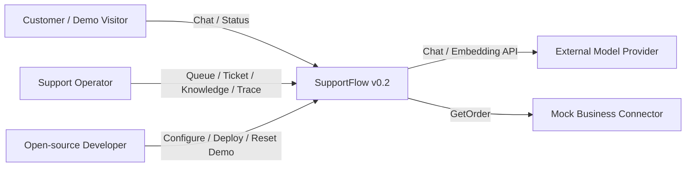
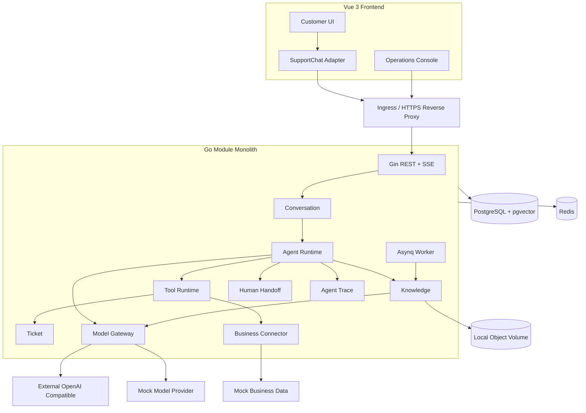
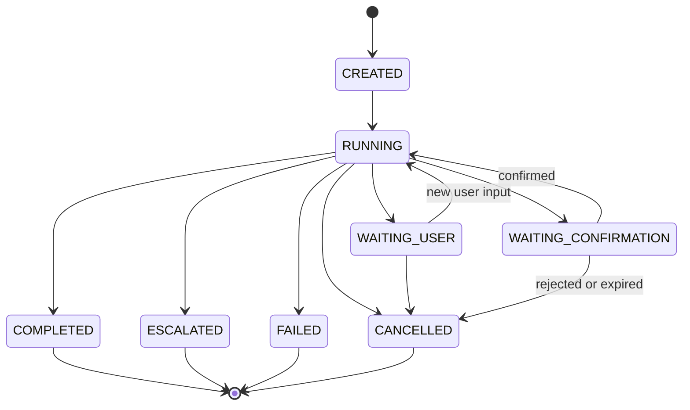
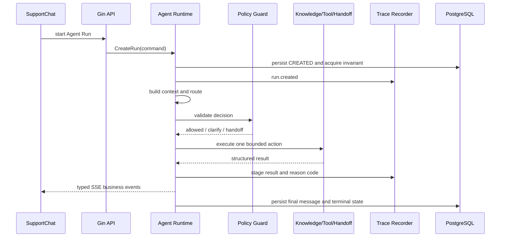
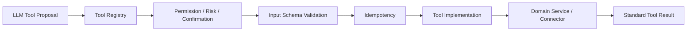
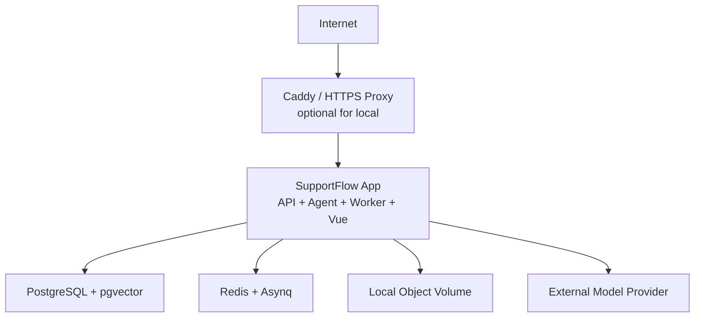

# SupportFlow 技术架构设计

> 面向 v0.2 SupportFlow MVP 的模块化单体架构，并为 v0.3 Enterprise Foundation 保留演进边界。

## 1. 文档信息

| 项目 | 内容 |
| --- | --- |
| 文档版本 | Architecture v1.0 |
| 文档状态 | 评审版（Review） |
| 创建日期 | 2026-07-24 |
| 需求基线 | `docs/PRD.md` v1.1 |
| 当前目标版本 | v0.2 SupportFlow MVP |
| 参考部署环境 | 2 vCPU / 2 GiB RAM / 40 GiB Disk / 200 Mbps / 1 IPv4 |

### 1.1 文档目的

本文档定义 SupportFlow 的系统边界、技术栈、模块职责、依赖方向、Agent Runtime、Tool Interface、Model Gateway、Knowledge/RAG、异步任务、数据基础设施、部署与故障处理策略。

### 1.2 文档边界

本文档不定义具体数据库表、字段、索引 DDL、完整 REST Endpoint、SSE Payload Schema 或开发任务。它们分别进入 `docs/Database.md`、`docs/API.md` 和 Task 拆分阶段。

## 2. 架构目标与约束

### 2.1 架构目标

1. 在 2 vCPU、2 GiB 内存的服务器上运行完整 v0.2 Demo 闭环。
2. 让 Agent 的路由、权限、Tool 执行、人工接管与 Trace 具备明确边界。
3. 使用确定性代码控制业务安全，LLM 只提供受约束的结构化决策。
4. 保持模块清晰，避免 MVP 阶段引入微服务和重型基础设施。
5. 保留 Workspace、RBAC、真实 Connector、S3 和多实例部署的演进接口。
6. 使核心故障可定位、异步任务可恢复、关键写操作可幂等。

### 2.2 强制约束

- v0.2 是单一默认租户、Demo 身份和 Mock Business Data，不是企业生产版本。
- 不运行本地 LLM、Embedding Model、OCR、独立搜索引擎或重型 Reranker。
- 不保存或展示模型 CoT。
- Agent 不直接判断售后资格，不直接绕过 Tool Permission Registry。
- PostgreSQL 是唯一业务事实源，Redis 只保存短期协调数据。
- 所有核心业务对象预留非空 `tenant_id`；v0.2 使用固定默认租户。
- Agent Run 与 Agent Trace 分离建模。
- 高风险业务操作不注册为 v0.2 可执行 Tool。

### 2.3 非目标

- 微服务拆分、Service Mesh 和分布式事务。
- Kubernetes、高可用、自动扩缩容和企业灾备。
- 任意 Provider、任意 Connector 或插件动态加载。
- 在线 Prompt 调试、模型实验平台和 CoT 查看器。
- 多 Agent 协作、长期用户记忆和自动学习。

## 3. 关键架构决策摘要

| 决策 | v0.2 方案 | 原因 |
| --- | --- | --- |
| 架构形态 | 前后端分离开发、模块化单体后端 | 控制部署与维护复杂度 |
| Lite 物理部署 | API、Worker、Vue 静态资源合并为一个 App | 降低内存与容器开销 |
| 后端 | Go 1.24+、Gin、REST、SSE | 单二进制、并发与流式能力稳定 |
| 前端 | Vue 3、TypeScript、Vite、TDesign | 复用成熟设计系统，避免从零生成 UI |
| Agent Runtime | 自研显式状态机 | 受控、可测试、可追踪 |
| 异步任务 | Redis + Asynq，PostgreSQL 保存权威状态 | 投递轻量且任务可恢复 |
| 主数据库 | PostgreSQL + pgvector | 事务、全文/词法检索和向量检索统一 |
| 文档存储 | Local Object Storage Adapter | Lite 环境不运行 MinIO，未来可换 S3 |
| 模型接入 | Mock + External OpenAI Compatible | 不占用本地推理资源 |
| RAG | PostgreSQL 词法检索 + pgvector + RRF | 无独立搜索服务的轻量 Hybrid Retrieval |
| 系统观测 | slog + OpenTelemetry Ready | 保持低资源运行，按需接入 Collector |
| 业务观测 | 独立 Agent Trace | 与系统日志、OpenTelemetry、Audit 分离 |

## 4. 系统上下文



v0.2 的外部业务系统只有 Mock Connector。v0.3 才通过可信 Customer Token 和 Workspace 级 Business Connector 接入真实企业系统。

## 5. 总体架构

### 5.1 逻辑架构



### 5.2 逻辑分离与物理合并

模块边界是代码和职责边界，不要求每个模块对应独立进程。v0.2 Lite Profile 将 API、Agent Runtime、Asynq Worker 和静态前端资源打包到同一 SupportFlow App 中运行，但模块只能通过已定义的 Application Service 或 Port 协作。

### 5.3 依赖方向

```text
Transport / UI Adapter
        ↓
Application Services
        ↓
Domain Modules and Ports
        ↓
Infrastructure Adapters
```

约束：

- Domain 不依赖 Gin、pgx、Asynq、Provider SDK 或本地文件路径。
- Transport 层不直接写数据库。
- Agent Runtime 不直接访问其他模块的数据表。
- Tool Implementation 通过 Domain Service 或 Connector Port 完成业务动作。
- Infrastructure Adapter 可以依赖 Domain Port，Domain 不能反向依赖 Adapter。

## 6. 技术栈

### 6.1 Frontend

| 类别 | 选型 |
| --- | --- |
| Framework | Vue 3 + TypeScript |
| Build | Vite |
| Routing | Vue Router |
| State | Pinia |
| i18n | Vue I18n |
| UI System | TDesign Vue Next Starter |
| Chat UI | TDesign Chat for Vue |
| Streaming | Fetch Stream + typed SSE events |

### 6.2 Backend

| 类别 | 选型 |
| --- | --- |
| Language | Go 1.24+ |
| HTTP | Gin |
| API | REST + JSON |
| Streaming | SSE |
| Database Driver | pgx |
| Async | Redis + Asynq |
| Logging | slog |
| System Telemetry | OpenTelemetry Ready |
| Runtime | Explicit Agent State Machine |

数据库查询组织方式、Migration 工具和 Repository 代码生成方式在数据库设计阶段确认。

### 6.3 Infrastructure

| 类别 | v0.2 Lite |
| --- | --- |
| Database | PostgreSQL + pgvector |
| Cache/Queue | Redis |
| Object Storage | Local Volume Adapter |
| Ingress | Caddy 或同级轻量 HTTPS Proxy，可选 |
| Runtime | Docker Compose |
| Model | External OpenAI Compatible / Mock |

## 7. 后端模块边界

| 模块 | 主要职责 | 不负责 |
| --- | --- | --- |
| Identity/Demo Session | Demo 身份、默认租户上下文、Session 生命周期 | v0.3 企业 SSO/RBAC |
| Conversation | 会话、消息、消息归属、当前活动 Run | 路由与 Tool 决策 |
| Agent Runtime | 状态机、路由编排、Policy、Context、Executor 协调 | 直接数据库写入和业务资格判断 |
| Knowledge | 文档版本、解析、Chunk、Embedding、检索、Citation | 自动发布和 OCR |
| Tool Runtime | Registry、权限、Schema、确认、超时、重试、结果归一化 | 直接接受 LLM 未校验调用 |
| Ticket | 工单规则、幂等创建、状态流转、Timeline | 对话消息存储 |
| Human Handoff | 接管触发、队列、领取、状态和上下文 | 自动创建工单 |
| Agent Trace | 结构化业务轨迹、原因代码和阶段耗时 | CoT、系统日志和 Audit |
| Notification/Status | 站内业务事件、未读状态、Customer 状态中心 | 原始系统告警 |
| Demo | NovaTech 种子数据、重置、配额和清理 | Platform Admin 能力 |

### 7.1 模块协作规则

- Conversation 通过 Agent Application Service 创建 Run。
- Agent Runtime 通过 Port 调用 Knowledge、Tool、Handoff 和 Trace。
- Tool Runtime 通过 Ticket Service 或 Business Connector 执行操作。
- Knowledge Worker 只通过 Knowledge Application Service 改变文档状态。
- 模块间不得通过直接更新对方表实现业务协作。
- 跨模块查询优先使用只读 Query Service，写操作必须调用目标模块 Command Service。

## 8. 前端架构

### 8.1 工程组织

v0.2 使用一个 Vue 工程和一个构建产物，按路由与 Layout 分离客户端和运营端：

```text
frontend/src/
├── app/
│   ├── customer/
│   └── console/
├── components/
│   └── SupportChat/
├── api/
├── stores/
├── locales/
│   ├── zh-CN.ts
│   └── en-US.ts
├── router/
└── shared/
```

目录仅表达职责，最终文件命名在开发任务阶段确定。

### 8.2 TDesign 使用边界

- TDesign Vue Next Starter 提供运营后台布局和基础组件。
- TDesign Chat 提供消息、Markdown、操作栏、加载状态等 UI 能力。
- `SupportChat` 是业务 Anti-Corruption Layer，不允许业务页面直接依赖 TDesign Chat 的协议细节。
- `SupportChat` 负责 TDesign 配置、Vue I18n 文案、SSE 事件转换、业务状态、Citation、订单卡片和工单卡片。
- 禁用 ChatThinking/Reasoning 展示，不把 Agent CoT 映射到 UI。
- v0.2 隐藏附件入口；后续开放附件时仍通过 `SupportChat` 扩展。
- 不修改 `node_modules`；无法覆盖的文案通过 Wrapper、Slot 或受控样式层处理。

### 8.3 状态管理

- Pinia 保存 Demo Session、当前会话、未读状态和 UI 状态。
- 业务事实以 Backend 返回为准，Pinia 不作为权威状态源。
- SSE Delta 可暂存在前端，终态消息必须以 Backend 持久化结果为准。
- 页面权限不能只靠前端路由守卫；v0.3 由 Backend RBAC 强制校验。

## 9. Agent Runtime

### 9.1 内部组件

| 组件 | 职责 |
| --- | --- |
| Orchestrator | 推进 Run、调用组件、控制步骤上限和终态 |
| State Machine | 校验 Run 状态转换 |
| Router | 生成五类固定路由的结构化候选 |
| Policy Guard | 身份、风险、权限、确认和业务约束校验 |
| Context Builder | 按优先级与 Token Budget 构建模型上下文 |
| Knowledge Executor | 执行检索并返回 Citation Candidate |
| Tool Executor | 校验并执行 Tool Proposal |
| Response Composer | 生成用户回复和结构化 UI 结果 |
| Handoff Controller | 创建人工接管请求与上下文包 |
| Trace Recorder | 保存结构化业务轨迹和阶段耗时 |

### 9.2 固定路由

```text
KNOWLEDGE_ANSWER
ORDER_QUERY
TICKET_CREATION
CLARIFICATION
HUMAN_HANDOFF
```

Router 返回的只是候选决策。Policy Guard 可以拒绝、改为 Clarification 或强制 Human Handoff，但不能新增第六类动态路由。

### 9.3 Agent Run 状态机



状态转换必须由 State Machine 执行，不允许 Repository 接口绕过状态规则。

### 9.4 单次执行流程



### 9.5 并发与执行租约

- 同一 Conversation 同一时刻只允许一个活动 Run。
- PostgreSQL 保存活动 Run 的权威状态并承担最终一致性约束。
- Redis 执行租约用于快速互斥，必须设置 Owner、TTL 和续租机制。
- 获取租约后仍需检查 PostgreSQL 状态，不能只依赖 Redis 判断。
- Lite 环境默认 Agent 并发为 1、最大为 2。
- 超出并发额度时排队或返回结构化繁忙状态，不启动额外 Goroutine 绕过限制。

### 9.6 SSE 断开与恢复

- 交互式 Run 在 Backend 内执行，不进入 Asynq。
- SSE 断开不等同于取消 Run；Backend 在超时范围内继续完成并保存终态。
- 流式 Delta 是瞬时事件，最终 Assistant Message 和 Run 状态保存到 PostgreSQL。
- 客户重连后以持久化消息和 Run 状态恢复，不依赖前端拼接结果作为事实源。
- Backend 进程中断时未完成 Run 标记为 `FAILED`，用户可创建新的安全重试 Run。

### 9.7 Trace 失败策略

- Run 创建和关键决策必须先成功写入 Trace，再继续执行。
- 在状态变更 Tool 前无法写入 Trace 时必须失败关闭，不执行 Tool。
- 流式文本阶段 Trace 失败时停止继续生成，保存可用状态并标记 Run 失败。

## 10. Context 与 Prompt

### 10.1 Context 层级

```text
Platform Security Policy
→ Agent Task Policy
→ Conversation Summary
→ Recent Messages
→ Business Context
→ Retrieved Knowledge
→ Tool Result
```

- 上层规则优先于下层内容。
- Customer 输入、Knowledge Chunk 和 Tool Result 都按不可信数据处理。
- Context Builder 只暴露完成当前任务所需的最小字段。

### 10.2 Prompt 管理

- v0.2 Prompt 模板随代码版本管理，不提供在线编辑器。
- 每个 Run 记录 `prompt_version`、model profile 和上下文引用 ID。
- Trace 不保存完整拼接 Prompt，不保存 CoT。
- Prompt 变更需要代码审查和验收集回归。

### 10.3 Token Budget

- 安全规则、必要 Tool Result 和当前 Customer 输入不可裁剪。
- 超出预算时优先裁剪旧消息、低排名知识和非必要展示字段。
- 长会话采用结构化摘要 + 最近消息，不无限发送完整历史。
- 摘要只包含问题、已尝试方案、Customer 确认、业务对象引用和当前结果。
- 不实现跨会话个人记忆和长期用户画像。

## 11. Tool Runtime 与 Tool Interface

### 11.1 执行管线



LLM 无权直接调用实现。Tool Executor 必须完成全部校验后才能调用 Tool。

### 11.2 概念接口

```go
type Tool interface {
    Spec() ToolSpec
    Execute(ctx context.Context, call ToolCall) ToolResult
}
```

该接口用于表达架构约束，最终 Go 类型在 API/Task 设计阶段确定。

### 11.3 ToolSpec

ToolSpec 至少表达：

- 稳定名称与版本。
- 读写类型。
- 风险等级。
- 输入与输出 Schema。
- 所需权限。
- 是否需要 Customer 确认。
- 超时与允许重试类型。
- 是否支持 Idempotency Key。

### 11.4 ToolCall Context

ToolCall 不信任 LLM 提供的身份字段。执行上下文由系统注入：

- `tenant_id`
- `run_id`
- `conversation_id`
- Customer 引用
- 权限与确认状态
- Idempotency Key
- Trace Context

### 11.5 ToolResult

ToolResult 必须分离：

- **Execution Status**：技术执行成功、失败或结果未知。
- **Business Result**：成功、数据不存在、资格不符、业务拒绝等。
- **Safe Output**：可提供给 Agent 和 UI 的结构化数据。
- **Trace Metadata**：工具名、版本、耗时、错误代码和脱敏摘要。

业务拒绝不计为技术失败；错误 Tool 即使执行成功，也必须在 Agent 路由指标中判错。

### 11.6 v0.2 Tool

| Tool | 类型 | 实现目标 | 确认 |
| --- | --- | --- | --- |
| `GetOrder` | READ | Mock Business Connector | 不需要额外业务确认，但强制 Customer 归属校验 |
| `CreateTicket` | WRITE | Ticket Domain Service | 必须完成订单/问题确认和资格校验 |

退款、取消订单、修改订单和删除数据不注册为可执行 Tool。

### 11.7 事务与重试

- 每个 Tool 调用是独立事务边界，不在 Tool 间实现分布式事务。
- `CreateTicket` 使用 Idempotency Key，只有取得有效工单编号才视为成功。
- `GetOrder` 只对限流和暂时不可用最多重试 2 次。
- `CreateTicket` 超时后只允许使用相同 Idempotency Key 重试 1 次。
- 身份、权限、参数、数据不存在和业务拒绝不重试。
- 结果未知时不得假定成功，应核对结果或进入人工接管。

### 11.8 Registry 演进

- v0.2 Registry 为代码内静态注册，只包含已审核 Tool。
- v0.3 将启用状态、风险与权限扩展到 Workspace 配置，但 Tool 实现仍由平台白名单控制。
- Registry 配置不能降低平台强制安全规则。

## 12. Model Gateway

### 12.1 Port

```text
ChatModel
├── Complete
├── Stream
└── StructuredOutput

EmbeddingModel
└── Embed
```

Chat 与 Embedding 分开配置，可以使用不同模型和 Profile。

### 12.2 v0.2 Adapter

- Mock Chat/Embedding Adapter。
- External OpenAI Compatible Chat/Embedding Adapter。
- GPT 与 DeepSeek 可通过部署侧验证过的 OpenAI Compatible Profile 接入。
- Claude 等非兼容 Adapter 留到后续版本。

### 12.3 Gateway 职责

- 内部请求与 Provider 协议转换。
- 认证、超时、并发额度和错误归一化。
- 流式响应转为内部事件。
- Structured Output Schema 校验前的基础解析。
- Token 用量与估算成本采集。
- Provider Capability 检查。

Gateway 不负责路由、权限、售后资格和 Tool 决策。

### 12.4 可靠性规则

- Provider 输出始终视为不可信，Router/Policy/Schema 必须再次校验。
- 首个流式内容输出前发生暂时错误时允许有限重试。
- 已输出部分内容后不得透明重试，防止重复消息和重复 Tool Proposal。
- Provider 失败时不得静默切换为 Mock 并伪造真实答案。
- Provider Endpoint 和 Model 使用部署白名单，不允许 Customer 输入任意地址。
- Provider 凭据不得进入 Trace、Audit 或系统日志。

## 13. Knowledge 与 Hybrid RAG

### 13.1 文档摄取流程

```mermaid
flowchart LR
    Upload["Upload Markdown / Text PDF"]
    Object["Object Storage Adapter"]
    Version["Document Version: PROCESSING"]
    Job["Durable Task + Asynq"]
    Parser["Parser"]
    Normalize["Normalizer"]
    Chunk["Chunker"]
    Embed["Embedding Gateway"]
    Index["PostgreSQL + pgvector"]
    Review["PENDING_REVIEW"]
    Publish["Atomic Publish"]

    Upload --> Object --> Version --> Job --> Parser --> Normalize --> Chunk --> Embed --> Index --> Review --> Publish
```



### 13.2 Parser 边界

- v0.2 仅解析 Markdown 和文本型 PDF。
- 不执行 OCR、图片理解、表格视觉解析或 Office 文档转换。
- Parser 输出规范化文本、章节、页码、内容哈希和基础元数据。
- 单文件上限 10 MiB，解析并发为 1。
- 原始文件通过 Object Storage Port 读取，不直接依赖本地路径。

### 13.3 Chunk 与 Index Version

- Chunk 必须关联 `tenant_id`、document、document version、section、page 和 index version。
- Embedding Profile 是 Index Version 的组成部分。
- 更换 Embedding Model 时创建新 Index Version，不在原索引上混用向量维度或语义空间。
- 新版本处理失败时旧 Published Version 继续服务。
- 发布时原子切换 Active Version，避免半索引状态参与检索。

### 13.4 检索流程

```text
Query Normalize
→ Query Embedding
→ Lexical Recall
→ Vector Recall
→ tenant_id / published version filters
→ RRF Fusion
→ score and evidence validation
→ Citation Candidates
```

- Lexical Recall 使用 PostgreSQL 原生能力；英文和可分词文本可使用全文索引，中文可使用规范化关键词与 `pg_trgm` 相似度，避免引入 Elasticsearch。
- Vector Recall 使用 pgvector。
- 使用 RRF 合并两路排名，不在 v0.2 引入独立 Reranker。
- 默认数据规模不超过 10,000 Chunks。
- 无可靠证据、低于阈值或知识冲突时不得生成确定性知识回答。
- 所有查询强制包含 `tenant_id` 与 Published Version 过滤。

### 13.5 Citation

- Citation 指向 document、version、section/page 和 chunk reference。
- UI 展示文档名称、章节或页码，不展示内部 Chunk ID。
- Trace 只记录命中文档元数据、分数、索引版本和 Citation ID，不复制完整 Chunk。

## 14. 异步任务与 Worker

### 14.1 Worker 职责

- 文档解析、Chunk 和 Embedding。
- 索引构建与发布前校验。
- Demo 数据过期清理与重置。
- 可重建的基础统计聚合任务。

交互式 Agent Run、SSE 和状态变更 Tool 不通过 Asynq 执行。

### 14.2 Durable Task 模型

- PostgreSQL 保存任务意图、业务对象、状态、尝试次数、租约和最后错误。
- 业务事务提交后再投递 Asynq。
- Asynq 负责调度和投递，不作为任务是否存在的权威来源。
- Handler 必须幂等，重复投递不得产生重复 Chunk、Index Version 或 Demo 数据。
- Reconciler 定期扫描超时或未投递的非终态任务并重新入队。
- 超过重试上限进入 `FAILED`，等待人工重试或重新触发。

### 14.3 Lite 与 Standard

- Lite：Worker 与 API 在同一 Go 进程、同一镜像中运行。
- Standard：同一镜像使用不同启动模式拆为 API Container 和 Worker Container。
- 两种模式共享 Domain/Application 代码，不复制实现。

## 15. 数据基础设施边界

### 15.1 PostgreSQL

保存：

- Demo Session、Customer 引用和默认租户。
- Conversation、Message。
- Agent Run。
- Agent Trace 与 Trace Event。
- Knowledge Document、Version、Chunk、Citation 和向量。
- Tool Call、Idempotency 记录。
- Ticket、Ticket Activity。
- Handoff Request。
- Durable Task 和必要指标字段。

PostgreSQL 是唯一业务事实源。具体表拆分、索引和外键在数据库设计阶段确定。

### 15.2 Redis

Redis 只保存：

- Asynq 队列和投递状态。
- Agent 执行租约。
- 限流计数。
- 短期并发额度与进程内事件协调所需的临时数据。

Redis 不保存最终消息、Run 终态、工单或知识事实。Redis 数据丢失后可依据 PostgreSQL 恢复任务和业务状态。

### 15.3 Object Storage Port

领域层只依赖抽象能力：

```text
Put
Open/Get
Delete
Exists/Stat
```

- Lite Adapter：本地持久化 Volume。
- v0.3 Adapter：S3-Compatible Object Storage。
- 数据库保存稳定 Object Key，不保存宿主机绝对路径。
- Object Key 必须包含租户隔离信息，但不能仅依赖路径实现权限校验。

### 15.4 tenant_id

- 所有核心业务记录使用非空 `tenant_id`。
- v0.2 使用固定默认租户，不实现 Workspace 管理 UI。
- Repository/Query Service 接口必须显式接收 Tenant Context。
- 不允许先查询全局数据再在内存中过滤租户。
- v0.3 是否增加 PostgreSQL RLS 在数据库设计阶段评估。

### 15.5 Agent Run 与 Trace 分离

- Agent Run 保存业务生命周期、当前状态、输入/输出引用和最终结果。
- Agent Trace 保存阶段事件、原因代码、耗时和脱敏技术元数据。
- 删除或归档 Trace 不得破坏 Run、Message、Ticket 等业务事实。
- Trace Event 只能追加，Run 状态按状态机更新。

## 16. 接口与通信风格

### 16.1 REST

- Query 与 Command 使用 REST + JSON。
- API 使用稳定错误码，不把后端语言文案作为机器判断依据。
- 写操作支持 Idempotency Key 时通过标准请求元数据传递。
- 外部 API、运营 API 和内部管理接口在路由层保持边界。

完整资源路径、Payload 和分页规范进入 `docs/API.md`。

### 16.2 SSE

v0.2 不引入 WebSocket。SSE 只发送业务事件，不发送 CoT。事件类别至少表达：

- Run 生命周期。
- 业务处理状态。
- Assistant Message Delta。
- Citation。
- Tool 生命周期与安全结果摘要。
- Handoff 状态。
- Run 完成或失败。

前端通过 Fetch Stream 读取，以支持 POST、认证和结构化错误处理。最终事件名称与 Schema 在 API 设计阶段冻结。

### 16.3 内部事件

- 同进程模块优先使用同步 Application Service 调用。
- 需要最终一致性的后台工作通过 Durable Task + Asynq。
- 不为模块化单体引入独立消息总线。
- 业务通知由明确 Domain Event 触发，不从 slog 或 OpenTelemetry 日志推断。

## 17. Trace、日志与系统可观测性

### 17.1 三类观测数据

| 类型 | 用途 | 示例 |
| --- | --- | --- |
| Agent Trace | 业务执行轨迹 | route、citation、tool、reason code、stage latency |
| System Log | 运行诊断 | error、warning、startup、dependency failure |
| OpenTelemetry | 系统链路与指标 | HTTP、DB、Redis、Provider latency |

v0.3 Audit Log 记录用户和管理员操作，仍与上述三类数据分离。

### 17.2 Correlation Context

在适用链路中传递：

- `request_id`
- `tenant_id`
- `conversation_id`
- `run_id`
- `trace_id`
- `tool_call_id`
- `task_id`

### 17.3 脱敏

- 密码、Token、Provider Key 永不记录。
- 邮箱、手机号、地址、订单号按字段策略掩码。
- Tool 参数和结果使用允许字段清单。
- Trace 保存 Message/Citation 引用或脱敏摘要，不复制原始敏感输入。
- slog Handler 在输出前执行统一字段过滤。

### 17.4 Lite 模式

- slog 输出 stdout。
- Docker 配置日志大小与文件数量轮转。
- OpenTelemetry Instrumentation 保留，但默认不启动 Collector、Prometheus 或 Grafana。
- Provider、检索、Tool 和总耗时继续写入 Agent Trace 的业务阶段字段。

## 18. 安全与信任边界

### 18.1 输入信任级别

```text
Platform Security Policy
  > Versioned Agent Policy
  > System-provided Identity and Permission
  > Business Service Result
  > Published Knowledge
  > Customer Input
```

低信任内容不能覆盖高信任规则。

### 18.2 Prompt Injection

- Knowledge Chunk 和 Customer Input 仅作为数据进入 Prompt。
- 文档中的“忽略规则”“调用工具”等内容不得进入控制通道。
- Router 输出必须符合固定 Schema 和枚举。
- Tool Proposal 必须经过 Registry、Policy、Schema 和确认检查。
- Tool 不能使用模型提供的 `tenant_id`、Customer ID 或权限信息。

### 18.3 文件安全

- 仅允许 Markdown 和文本型 PDF。
- 校验 MIME、扩展名、文件大小和解析结果。
- 文件名不直接成为本地路径。
- Parser 在受限并发和超时内运行。
- v0.2 不执行文件中的脚本、宏、外链资源或 OCR。

### 18.4 Secret 与网络

- Provider 凭据由部署配置注入，不进入代码仓库。
- Endpoint 使用部署白名单，避免 Customer 控制的 SSRF。
- v0.2 Mock Connector 不访问真实业务网络。
- Public Demo 应通过 HTTPS；Caddy 只负责 TLS 和反向代理，不承担业务逻辑。

## 19. 故障与降级策略

| 故障 | v0.2 行为 |
| --- | --- |
| PostgreSQL 不可用 | Readiness 失败，拒绝新业务写入，不降级到 Redis |
| Redis 不可用 | 暂停新异步任务和需要租约的 Agent Run，已有业务事实保留 |
| Object Volume 不可用 | 禁止新上传和解析，已发布且数据库可用的知识按可用状态处理 |
| Chat Provider 不可用 | 返回明确错误，不静默切换 Mock，不伪造回答 |
| Embedding Provider 不可用 | 摄取任务保留非终态并重试；旧 Published Index 继续服务 |
| Knowledge Retrieval 失败 | 不形成无依据回答，进入失败或人工接管路径 |
| SSE 断开 | Run 继续到终态，结果持久化；客户端重连读取状态 |
| Tool 暂时不可用 | 按错误类型有限重试，达到上限后人工接管 |
| CreateTicket 结果未知 | 使用相同 Idempotency Key 核对或重试，不假定成功 |
| Backend 进程退出 | 未完成 Run 标记失败；Durable Task 由 Reconciler 恢复 |
| Trace 写入失败 | 状态变更 Tool 前失败关闭，不执行不可追踪动作 |

## 20. Lite 部署架构

### 20.1 Docker Compose 拓扑



本地开发可直接访问 App；公网 Demo 必须通过 HTTPS Proxy。

### 20.2 参考主机与资源预算

Lite Profile 的最低参考主机固定为：

| 资源 | 基线 |
| --- | --- |
| CPU | 2 vCPU |
| 内存 | 2 GiB |
| 系统盘 | 40 GiB |
| 峰值公网带宽 | 200 Mbps |
| 公网地址 | 1 个固定 IPv4 |

内存预算：

| 长驻组件 | 建议内存上限 |
| --- | ---: |
| SupportFlow App | 512 MiB |
| PostgreSQL + pgvector | 512 MiB |
| Redis + Asynq | 96 MiB |
| Caddy | 64 MiB |

剩余内存留给 Linux、Docker Page Cache 和短时峰值。建议配置 1–2 GiB Swap 只用于峰值保护。

40 GiB 系统盘采用共享预算，不划分独立数据盘：操作系统、Docker 与镜像建议预留 12 GiB，PostgreSQL 数据不超过 10 GiB，知识原文件不超过 8 GiB，本机基础备份不超过 6 GiB，日志与临时文件不超过 2 GiB，并保留至少 2 GiB 安全空间。达到 80% 使用率时必须告警并优先清理可再生数据，不得自动删除业务事实或知识原文件。

公网只暴露 Caddy 的 `80/443` 端口；App、PostgreSQL 和 Redis 仅加入 Docker 内部网络。200 Mbps 是带宽上限而非 Agent 延迟保证，外部 Model Provider 延迟仍单独统计。

### 20.3 运行限制

- 同时在线 Demo Session 目标为 20。
- Agent 默认执行并发 1、最大 2。
- 文档解析并发 1。
- 单文件最大 10 MiB。
- 默认知识规模不超过 10,000 Chunks。
- 不在服务器执行 Go、Vue 或 Docker 镜像构建。
- 由 CI 发布预构建镜像，服务器执行 Migration、`docker compose pull` 和 `docker compose up`。
- PostgreSQL 数据与 Object Volume 需要基础备份。
- Docker 日志、过期 Demo 数据、临时文件和旧镜像必须定期清理。

### 20.4 健康检查

- Liveness：Go 进程事件循环可响应。
- Readiness：PostgreSQL、Redis 和必要本地 Volume 可访问。
- 外部 Model Provider 不作为容器 Liveness 条件；Provider 故障通过业务降级和状态接口暴露。
- Migration 失败时 App 不进入 Ready。

## 21. Standard 与 v0.3 演进

v0.3 可以在不改变模块职责的前提下演进：

- API 与 Worker 使用同一镜像、不同启动模式独立部署。
- Local Object Adapter 替换为 S3-Compatible Adapter。
- 默认租户升级为 Workspace 管理、可信 Customer Identity 和 Backend RBAC。
- Static Tool Registry 升级为 Workspace 级启用与权限配置。
- Mock Business Connector 替换为受控真实 Connector。
- 增加 Append Only Audit Log。
- 按需要启动 OpenTelemetry Collector 和外部观测系统。
- 多实例时增加跨实例 SSE/Event Fan-out；v0.2 不提前引入。

微服务拆分必须基于实际负载、团队边界或隔离要求，不能仅因模块名称不同而拆分。

## 22. 构建、迁移与发布

### 22.1 构建

- 前端通过 Vite 构建静态资源。
- Go 构建阶段将前端产物打入 SupportFlow App 镜像或同一发布制品。
- 使用多阶段 Docker Build，但构建发生在 CI/开发机，不发生在 Lite 服务器。
- 依赖版本必须锁定，TDesign Chat 通过 `SupportChat` Wrapper 隔离升级影响。

### 22.2 Migration

- Migration 使用顺序版本，应用启动前显式执行。
- Migration 是独立命令或一次性 Compose Job，不由多个 App 实例并发执行。
- Migration 失败时停止发布并保持旧版本可恢复。
- 具体工具与回滚策略在数据库设计文档中确认。

### 22.3 配置

- 区分 Development、Lite Demo 和 Production-like 配置。
- 非敏感配置通过环境变量或配置文件注入。
- Secret 使用环境注入或挂载文件，不提交仓库。
- 配置启动时校验，缺少必要项时 Fail Fast。
- Mock 与 External Provider 模式必须显式选择。

## 23. 架构风险与权衡

| 权衡 | 当前选择 | 影响 |
| --- | --- | --- |
| 模块化单体 vs 微服务 | 模块化单体 | 部署简单，但必须严格维护模块依赖 |
| App 内 Worker vs 独立 Worker | Lite 合并运行 | 省内存；解析任务必须限并发避免影响 API |
| PostgreSQL Hybrid vs 搜索引擎 | PostgreSQL + pgvector + lexical | 少一个服务；高级检索能力有限 |
| Local Volume vs S3 | Local Adapter | 适合单机；迁移和备份依赖明确 Object Key |
| External Model vs Local Model | External | 节省资源；受 Provider 延迟、成本和网络影响 |
| SSE vs WebSocket | SSE | 简单稳定；双向实时协作能力有限 |
| Static Tool Registry vs Dynamic Plugin | Static | 更安全可控；v0.2 扩展需代码发布 |
| TDesign Wrapper vs 直接使用 | Wrapper | 增加少量封装代码，换取替换和 i18n 能力 |

## 24. Architecture Decision Records

后续可将以下决策拆为 ADR：

- ADR-001：v0.2 采用模块化单体。
- ADR-002：Lite Profile 合并 API、Worker 与静态前端。
- ADR-003：Agent Runtime 使用显式状态机。
- ADR-004：PostgreSQL 是唯一业务事实源。
- ADR-005：Redis 只承担队列、租约和限流。
- ADR-006：Tool Proposal 与 Tool Execution 强制分离。
- ADR-007：Model Gateway 隔离 Provider。
- ADR-008：Hybrid Retrieval 使用 PostgreSQL + pgvector + RRF。
- ADR-009：TDesign Chat 通过 SupportChat Wrapper 接入。
- ADR-010：Agent Run 与 Agent Trace 分离建模。

## 25. 后续设计输入

### 25.1 Database Design

需要定义：

- 核心实体、主键、`tenant_id` 和关联。
- Agent Run、Trace Event、Tool Call 和 Durable Task 的表边界。
- Ticket、Handoff、Knowledge Version 和 Citation 状态结构。
- pgvector、全文/`pg_trgm` 索引与 Index Version。
- Idempotency、唯一活动 Run 和任务恢复约束。

### 25.2 API Design

需要定义：

- Customer 与 Operations REST 资源。
- Agent Run Command、查询和恢复接口。
- typed SSE Event Schema。
- Tool Result、错误码和 Idempotency Key 约定。
- Knowledge 上传、发布和任务状态接口。

### 25.3 暂缓决策

- 具体 ORM/Query Builder 或 SQL 代码生成方案。
- Migration 工具。
- PostgreSQL RLS 是否在 v0.3 启用。
- Standard Profile 的跨实例 SSE Fan-out。
- Claude 等非 OpenAI-Compatible Adapter。
- OCR、独立搜索引擎、Reranker、Workflow 和 Plugin。

---

**架构结论：** v0.2 使用 Go 模块化单体和显式 Agent State Machine，在 Lite Profile 中以一个 SupportFlow App 配合 PostgreSQL、Redis 和本地 Object Volume 运行；所有 LLM 决策必须经过确定性 Policy 与 Tool 边界，所有关键业务动作必须可持久化、可追踪、可恢复。
