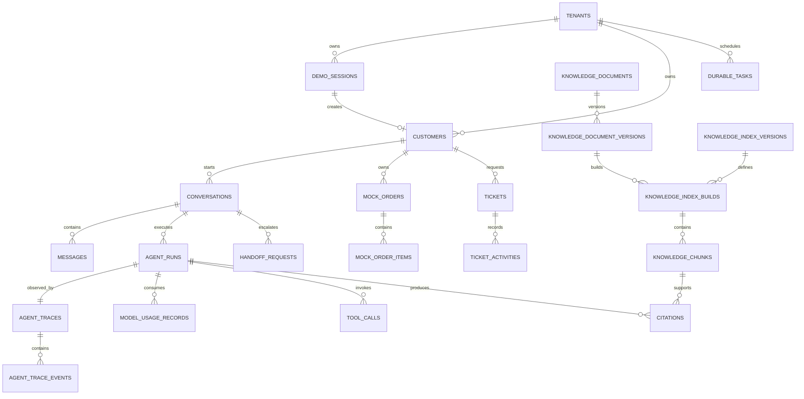

# SupportFlow 数据库设计

## 1. 文档信息

| 项目 | 内容 |
| --- | --- |
| 文档版本 | v1.0 |
| 文档状态 | 计划中（草案） |
| 对应产品版本 | v0.2 SupportFlow MVP |
| 编写日期 | 2026-07-24 |
| 上游文档 | [PRD](./PRD.md)、[Architecture](./Architecture.md) |
| 参考部署环境 | 2 vCPU / 2 GiB RAM / 40 GiB Disk |

### 1.1 文档目的

本文档把 v0.2 的业务对象、状态机和基础设施边界映射为 PostgreSQL 数据模型，明确表职责、字段、租户约束、索引、事务边界、数据生命周期和故障恢复规则，作为后续 Migration、API 与开发任务设计的输入。

### 1.2 文档边界

本文档只定义逻辑与物理数据设计，不包含：

- 完整 `CREATE TABLE`、Migration 文件或初始化脚本。
- REST/SSE 路径、请求响应结构或错误响应格式。
- Go Repository、Domain Service 或 Worker 实现。
- v0.3 完整 Workspace、RBAC、Audit、真实 Business Connector 与 Analytics 模型。
- 企业级高可用、自动备份、分区归档或灾备方案。

## 2. 设计目标与非目标

### 2.1 设计目标

1. PostgreSQL 是会话、Agent Run、Trace、知识、Tool、工单、接管和异步任务的唯一业务事实源。
2. 每个租户业务表使用非空 `tenant_id`，外键同时校验租户，避免跨租户关联。
3. Agent Run 与 Agent Trace 分离；删除或过期 Trace 不破坏业务事实。
4. 支持一个会话仅有一个活动 Run、知识版本原子发布、创建工单幂等和重复工单防护。
5. Redis 丢失后，可以从 PostgreSQL 的非终态任务和业务状态恢复异步工作。
6. 在不引入 Elasticsearch、独立向量库和对象存储服务的前提下支撑 v0.2 Lite Demo。
7. 数据结构为 v0.3 多 Workspace、真实 Connector 和基础 RBAC 保留稳定扩展点，但不让 v0.2 依赖这些能力。

### 2.2 非目标

- 不使用 Redis 保存最终消息、Run 终态、工单、知识状态或幂等结果。
- 不将 Trace、Audit、系统日志和 OpenTelemetry 数据合并到同一张表。
- 不把 JSONB 用作动态数据库或替代明确的关系字段。
- 不允许业务模块绕过所属模块的 Application Service 直接读写其他模块表。
- v0.2 不启用 PostgreSQL Row-Level Security（RLS），是否启用留待 v0.3 评估。
- v0.2 不做按租户分库、表分区、读写分离或多区域复制。

## 3. PostgreSQL 基线与通用约定

### 3.1 PostgreSQL 扩展

| 扩展 | 用途 | v0.2 要求 |
| --- | --- | --- |
| `vector` | 保存知识 Chunk Embedding 并执行向量检索 | 必须 |
| `pg_trgm` | 中文和短文本的规范化关键词相似度检索 | 必须 |

UUIDv7 由 Go 应用生成，不依赖数据库扩展生成主键。Migration 必须显式检查所需扩展是否可用，扩展版本变化不得由应用运行时自动执行。

### 3.2 主键与租户键

- `tenants` 是租户根表，以 `id uuid` 为主键，不再包含自身 `tenant_id`。
- 其他租户业务表统一使用 `tenant_id uuid NOT NULL`、`id uuid NOT NULL`，主键为 `(tenant_id, id)`。
- UUID 使用应用侧生成的 UUIDv7，以获得近似时间有序写入；面向用户的会话号、工单号等使用独立业务编号。
- 所有租户内外键使用 `(tenant_id, referenced_id)` 复合引用，不允许只按对象 UUID 建立跨表关联。
- Repository 和 Query Service 必须把 Tenant Context 作为显式参数；禁止先做全局查询再在内存中过滤。

### 3.3 字段类型与命名

| 数据 | 约定 |
| --- | --- |
| 时间 | `timestamptz`，数据库和应用统一使用 UTC |
| 时长 | `integer` 或 `bigint` 毫秒，字段名使用 `_ms` |
| 金额 | `bigint` 最小货币单位，同时保存 ISO 4217 `currency char(3)` |
| 哈希 | 小写十六进制文本；SHA-256 使用 `char(64)` |
| 状态 | 稳定状态机使用受控枚举类型；频繁演进的原因码使用版本化代码表约定 |
| 业务编号 | `text`，租户内唯一，不作为主键或外键 |
| 安全摘要 | 有边界的 `jsonb` 或脱敏文本，只保存允许字段 |
| 文件位置 | 保存稳定 Object Key，不保存宿主机绝对路径 |

所有表至少包含 `created_at`；可变聚合根包含 `updated_at` 和 `row_version bigint`。`row_version` 从 `1` 开始，每次状态变更递增，用于乐观并发控制。数据库不使用 `timestamp without time zone`。

### 3.4 JSONB 使用规则

JSONB 仅用于结构可能随 Provider 或 UI 卡片小幅演进、且不参与核心关系约束的安全数据：

- 脱敏的 Tool 输入/输出摘要。
- Trace 安全元数据。
- Message 结构化卡片内容。
- Durable Task 的版本化任务参数。
- Mock 订单商品属性。

每个 JSONB 字段必须有 `schema_version` 或由父记录的版本字段约束，应用层限制为 16 KiB；超过限制的数据进入明确关系表或 Object Storage。密码、Token、密钥、完整 Prompt、模型 CoT、未脱敏 Customer 输入和完整检索 Chunk 禁止写入 JSONB。

### 3.5 删除与保留约定

- 工单、Ticket Activity、已发布知识版本和已产生引用的知识 Chunk 不通过普通业务操作物理删除。
- Trace Event、Ticket Activity 和未来 Audit Event 按追加模式写入；普通应用路径不得修改已有事件。
- 外键默认使用 `RESTRICT`；可选关系因主体失效允许保留历史时才使用 `SET NULL`。
- `CASCADE` 只用于明确可重建、从未发布且未被引用的版本从属数据，例如失败 Index Build 下的 Chunk。
- Demo 过期清理是普通删除规则的受控例外，只处理标记了 Demo 生命周期的 Mock 数据；清理必须记录原因、作用范围和完成时间，不得误删默认 NovaTech 模板。

## 4. 数据域与表归属

v0.2 使用同一 PostgreSQL 数据库和应用 Schema，以降低 Migration 与运维复杂度。表由模块独占写入，跨模块读取通过 Application Service 或只读 Query Service 完成。

| 数据域 | 所属表 | 唯一写入模块 |
| --- | --- | --- |
| Tenant / Demo Identity | `tenants`、`demo_sessions`、`customers`、`workspace_members` | Identity / Demo |
| Conversation | `conversations`、`messages`、`message_feedback` | Conversation |
| Agent Runtime | `agent_runs` | Agent Runtime |
| Agent Trace | `agent_traces`、`agent_trace_events` | Agent Trace |
| Model Usage | `model_usage_records` | Model Gateway |
| Knowledge | `knowledge_documents`、`knowledge_document_versions`、`knowledge_index_versions`、`knowledge_index_builds`、`knowledge_chunks`、`citations`、`knowledge_operations_todos` | Knowledge |
| Tool Runtime | `tool_calls`、`tool_call_attempts`、`idempotency_records` | Tool Runtime |
| Mock Business Data | `mock_orders`、`mock_order_items` | Mock Business Connector |
| Ticket | `tickets`、`ticket_activities` | Ticket |
| Human Handoff | `handoff_requests` | Human Handoff |
| Notification | `notifications` | Notification / Status |
| Async Task | `durable_tasks` | Async / Worker |

`schema_migrations` 属于部署基础设施，不是租户业务表，不包含 `tenant_id`。

## 5. 高层关系模型



图中关系均受 `tenant_id` 复合外键约束。通知、反馈和知识运营待办为避免图过密未展开，但仍通过强外键关联 Customer、Message、Run 或业务目标。

## 6. 枚举与受控代码

### 6.1 固定状态枚举

| 类型 | 取值 |
| --- | --- |
| `agent_run_status` | `CREATED`、`RUNNING`、`WAITING_USER`、`WAITING_CONFIRMATION`、`COMPLETED`、`ESCALATED`、`FAILED`、`CANCELLED` |
| `agent_route` | `KNOWLEDGE_ANSWER`、`ORDER_QUERY`、`TICKET_CREATION`、`CLARIFICATION`、`HUMAN_HANDOFF` |
| `trace_status` | `RUNNING`、`COMPLETED`、`FAILED`、`CANCELLED` |
| `knowledge_version_status` | `DRAFT`、`PROCESSING`、`PENDING_REVIEW`、`PUBLISHED`、`FAILED`、`DISABLED` |
| `knowledge_todo_status` | `PENDING_SUPPLEMENT`、`PROCESSED`、`NO_ACTION_REQUIRED` |
| `ticket_status` | `PENDING`、`IN_PROGRESS`、`WAITING_CUSTOMER`、`RESOLVED`、`CLOSED`、`CANCELLED` |
| `handoff_status` | `WAITING`、`IN_PROGRESS`、`ENDED`、`CANCELLED` |
| `durable_task_status` | `PENDING`、`ENQUEUED`、`RUNNING`、`SUCCEEDED`、`FAILED`、`CANCELLED` |

### 6.2 其他稳定枚举

| 类型 | 取值 |
| --- | --- |
| `message_actor_type` | `CUSTOMER`、`AGENT`、`MEMBER`、`SYSTEM` |
| `message_content_type` | `TEXT`、`ORDER_CARD`、`TICKET_CARD`、`HANDOFF_STATUS`、`SYSTEM_STATUS` |
| `feedback_value` | `HELPFUL`、`NOT_HELPFUL` |
| `conversation_status` | `OPEN`、`CLOSED` |
| `response_owner` | `AGENT`、`HUMAN` |
| `tool_execution_status` | `CREATED`、`VALIDATED`、`EXECUTING`、`SUCCEEDED`、`FAILED`、`UNKNOWN`、`CANCELLED` |
| `tool_business_result` | `SUCCESS`、`NOT_FOUND`、`INELIGIBLE`、`REJECTED`、`NOT_APPLICABLE`、`UNKNOWN` |
| `ticket_priority` | `LOW`、`NORMAL`、`HIGH`、`URGENT` |
| `activity_visibility` | `PUBLIC`、`INTERNAL` |
| `knowledge_index_status` | `BUILDING`、`ACTIVE`、`FAILED`、`RETIRED` |
| `knowledge_build_status` | `PENDING`、`PROCESSING`、`READY`、`FAILED`、`CANCELLED` |
| `demo_session_status` | `ACTIVE`、`EXPIRED`、`REVOKED`、`RESETTING`、`RESET` |

事件类型、错误代码、路由原因、接管原因、工单创建原因和通知事件使用大写蛇形受控代码。代码必须登记在版本化应用常量中，数据库以 `text` 保存并限制长度和字符集，禁止用自由文本代替业务判断。新增代码不应要求改变历史记录。

## 7. Tenant 与 Demo Identity

### 7.1 `tenants`

租户根和隔离边界。v0.2 初始化一个固定 NovaTech 默认租户，不提供 Workspace 管理 UI。

| 字段 | PostgreSQL 类型 | 空值/默认 | 约束与说明 |
| --- | --- | --- | --- |
| `id` | `uuid` | 非空 | 主键，UUIDv7 |
| `slug` | `text` | 非空 | 全局唯一，小写标识，最长 64 |
| `display_name` | `text` | 非空 | 最长 160 |
| `status` | `text` | 非空，`ACTIVE` | `ACTIVE`、`DISABLED` |
| `is_demo` | `boolean` | 非空，`false` | NovaTech 默认租户为 `true` |
| `data_generation` | `integer` | 非空，`1` | Demo 重置代次，只递增 |
| `created_at` | `timestamptz` | 非空，当前时间 | 创建时间 |
| `updated_at` | `timestamptz` | 非空，当前时间 | 更新时间 |
| `row_version` | `bigint` | 非空，`1` | 乐观锁 |

关键索引：`UNIQUE(slug)`。`tenants` 不允许通过应用业务接口删除。

### 7.2 `demo_sessions`

保存游客短期 Session 和开发者体验账号的 Demo 生命周期与配额，不保存原始 Session Token。

| 字段 | PostgreSQL 类型 | 空值/默认 | 约束与说明 |
| --- | --- | --- | --- |
| `tenant_id`、`id` | `uuid` | 非空 | 复合主键；租户外键 |
| `token_hash` | `char(64)` | 非空 | Session Token SHA-256；租户内唯一 |
| `session_type` | `text` | 非空 | `VISITOR`、`DEVELOPER` |
| `status` | `demo_session_status` | 非空，`ACTIVE` | Session 生命周期 |
| `data_generation` | `integer` | 非空 | 创建时复制租户重置代次 |
| `request_limit` | `integer` | 非空 | 大于 0 |
| `token_limit` | `bigint` | 非空 | 大于等于 0 |
| `upload_file_limit` | `integer` | 非空 | 大于等于 0 |
| `request_count` | `integer` | 非空，`0` | 配额事实快照；限流热计数仍在 Redis |
| `token_count` | `bigint` | 非空，`0` | 已确认 Token 用量 |
| `upload_file_count` | `integer` | 非空，`0` | 当前有效上传数 |
| `last_seen_at` | `timestamptz` | 可空 | 最近活动时间 |
| `expires_at` | `timestamptz` | 非空 | 游客短期过期；必须晚于创建时间 |
| `reset_requested_at` | `timestamptz` | 可空 | 手动或周期重置请求时间 |
| `reset_completed_at` | `timestamptz` | 可空 | 清理完成时间 |
| `created_at`、`updated_at` | `timestamptz` | 非空 | 生命周期时间 |
| `row_version` | `bigint` | 非空，`1` | 并发更新 |

关键索引：`UNIQUE(tenant_id, token_hash)`；`(tenant_id, status, expires_at)` 用于过期扫描；`(tenant_id, session_type, last_seen_at)` 用于开发者账号周期重置。

### 7.3 `customers`

Customer 与 Workspace Member 分离。v0.2 Customer 仅来源于 Demo Session；字段为未来可信 Connector 身份映射保留最小扩展点。

| 字段 | PostgreSQL 类型 | 空值/默认 | 约束与说明 |
| --- | --- | --- | --- |
| `tenant_id`、`id` | `uuid` | 非空 | 复合主键 |
| `demo_session_id` | `uuid` | 可空 | v0.2 Visitor 对应 Session；复合外键 |
| `source` | `text` | 非空，`DEMO` | `DEMO`、未来 `CONNECTOR` |
| `external_subject_hash` | `char(64)` | 可空 | 未来可信主体标识哈希，不保存 Token |
| `display_name` | `text` | 非空 | Demo 显示名，最长 120 |
| `locale` | `text` | 非空，`zh-CN` | BCP 47 语言标签 |
| `status` | `text` | 非空，`ACTIVE` | `ACTIVE`、`DISABLED`、`EXPIRED` |
| `expires_at` | `timestamptz` | 可空 | Demo Customer 继承 Session 生命周期 |
| `anonymized_at` | `timestamptz` | 可空 | 未来脱敏生命周期 |
| `created_at`、`updated_at` | `timestamptz` | 非空 | 生命周期时间 |
| `row_version` | `bigint` | 非空，`1` | 乐观锁 |

关键约束：一个 Visitor Session 至多一个活动 Customer；`UNIQUE(tenant_id, demo_session_id)` 仅作用于非空值。未来 Connector Customer 使用 `UNIQUE(tenant_id, source, external_subject_hash)` 的部分唯一索引。

### 7.4 `workspace_members`

只支持 v0.2 Demo 运营端所需的基础角色，不等同于 v0.3 RBAC。

| 字段 | PostgreSQL 类型 | 空值/默认 | 约束与说明 |
| --- | --- | --- | --- |
| `tenant_id`、`id` | `uuid` | 非空 | 复合主键 |
| `subject_key` | `text` | 非空 | 本地/Demo 登录主体稳定键，不是密码 |
| `display_name` | `text` | 非空 | 最长 120 |
| `role` | `text` | 非空 | `SUPPORT_AGENT`、`KNOWLEDGE_OPERATOR`、`DEMO_ADMIN` |
| `status` | `text` | 非空，`ACTIVE` | `ACTIVE`、`DISABLED` |
| `created_at`、`updated_at` | `timestamptz` | 非空 | 生命周期时间 |
| `row_version` | `bigint` | 非空，`1` | 乐观锁 |

关键索引：`UNIQUE(tenant_id, subject_key)`；`(tenant_id, role, status)`。Session、密码、邀请、权限策略和临时授权属于 v0.3 身份设计。

## 8. Conversation、Message 与反馈

### 8.1 `conversations`

会话负责沟通上下文，不承载工单处理状态。

| 字段 | PostgreSQL 类型 | 空值/默认 | 约束与说明 |
| --- | --- | --- | --- |
| `tenant_id`、`id` | `uuid` | 非空 | 复合主键 |
| `conversation_number` | `text` | 非空 | 面向用户的租户内唯一编号 |
| `customer_id` | `uuid` | 非空 | 复合外键到 Customer |
| `status` | `conversation_status` | 非空，`OPEN` | 会话是否结束 |
| `response_owner` | `response_owner` | 非空，`AGENT` | 当前允许自动回复或人工回复 |
| `subject` | `text` | 可空 | 脱敏标题，最长 240 |
| `consecutive_unresolved_count` | `smallint` | 非空，`0` | 0–3；用于连续三次未解决规则 |
| `resolution_outcome` | `text` | 可空 | 固定代码，如 `KNOWLEDGE_RESOLVED`、`ORDER_RETURNED`、`TICKET_CREATED`、`HANDOFF`、`ABANDONED`、`OUT_OF_SCOPE` |
| `human_involved` | `boolean` | 非空，`false` | 一旦人工领取后不可恢复为 `false` |
| `next_message_sequence` | `bigint` | 非空，`1` | 在行锁内分配消息顺序号 |
| `last_message_at` | `timestamptz` | 可空 | 会话列表排序 |
| `closed_at` | `timestamptz` | 可空 | `CLOSED` 时非空 |
| `expires_at` | `timestamptz` | 可空 | Demo 生命周期 |
| `created_at`、`updated_at` | `timestamptz` | 非空 | 生命周期时间 |
| `row_version` | `bigint` | 非空，`1` | 状态并发控制 |

关键索引：`UNIQUE(tenant_id, conversation_number)`；`(tenant_id, customer_id, last_message_at DESC)`；`(tenant_id, status, last_message_at DESC)`。`closed_at` 与 `status` 必须一致。

### 8.2 `messages`

只持久化最终业务消息；SSE Token Delta 不逐条入库。通知和系统日志不得写入该表。

| 字段 | PostgreSQL 类型 | 空值/默认 | 约束与说明 |
| --- | --- | --- | --- |
| `tenant_id`、`id` | `uuid` | 非空 | 复合主键 |
| `conversation_id` | `uuid` | 非空 | 复合外键 |
| `sequence_no` | `bigint` | 非空 | 会话内严格递增 |
| `actor_type` | `message_actor_type` | 非空 | 消息主体类型 |
| `customer_id` | `uuid` | 可空 | Customer 消息时必填 |
| `member_id` | `uuid` | 可空 | 人工客服消息时必填 |
| `agent_run_id` | `uuid` | 可空 | Agent 最终消息或业务状态的 Run 引用 |
| `content_type` | `message_content_type` | 非空 | 文本或结构化业务卡片 |
| `content_text` | `text` | 可空 | 规范化、完成必要脱敏后的文本，最长 50,000 字符 |
| `content_payload` | `jsonb` | 可空 | 版本化 UI 卡片安全字段，不含业务事实全集 |
| `locale` | `text` | 可空 | 消息语言 |
| `redaction_state` | `text` | 非空，`APPLIED` | `APPLIED`、`NOT_REQUIRED`；禁止保存待脱敏内容 |
| `content_sha256` | `char(64)` | 非空 | 规范化持久化内容哈希 |
| `created_at` | `timestamptz` | 非空 | 消息时间 |

关键约束：`UNIQUE(tenant_id, conversation_id, sequence_no)`；至少一个内容字段非空；主体引用与 `actor_type` 匹配。关键索引：`(tenant_id, conversation_id, sequence_no)`、`(tenant_id, agent_run_id)`。消息内容不可在 Trace 中复制。

### 8.3 `message_feedback`

Customer 的有帮助/无帮助反馈独立于消息保存，并触发知识运营闭环。

| 字段 | PostgreSQL 类型 | 空值/默认 | 约束与说明 |
| --- | --- | --- | --- |
| `tenant_id`、`id` | `uuid` | 非空 | 复合主键 |
| `message_id` | `uuid` | 非空 | 被评价的 Agent 消息 |
| `conversation_id` | `uuid` | 非空 | 便于租户和会话校验 |
| `customer_id` | `uuid` | 非空 | 反馈主体 |
| `value` | `feedback_value` | 非空 | `HELPFUL` 或 `NOT_HELPFUL` |
| `reason_code` | `text` | 可空 | 受控原因代码，最长 64 |
| `comment_summary` | `text` | 可空 | 脱敏摘要，最长 500 |
| `created_at`、`updated_at` | `timestamptz` | 非空 | 允许 Customer 修改一次当前评价 |
| `row_version` | `bigint` | 非空，`1` | 并发控制 |

关键约束：`UNIQUE(tenant_id, message_id, customer_id)`；服务必须验证 Message 属于该 Conversation 和 Customer。索引 `(tenant_id, value, created_at DESC)` 支持基础知识效果查询。

## 9. Agent Run、Trace 与模型用量

### 9.1 `agent_runs`

保存一次受控 Agent 执行的业务生命周期，不保存模型内部推理。

| 字段 | PostgreSQL 类型 | 空值/默认 | 约束与说明 |
| --- | --- | --- | --- |
| `tenant_id`、`id` | `uuid` | 非空 | 复合主键 |
| `conversation_id` | `uuid` | 非空 | 复合外键 |
| `customer_id` | `uuid` | 非空 | 系统注入的 Customer，不接受模型参数 |
| `trigger_message_id` | `uuid` | 非空 | 创建 Run 的首条 Customer Message |
| `output_message_id` | `uuid` | 可空 | 完成后生成的最终 Agent Message |
| `client_request_id` | `text` | 非空 | 客户端重试去重键，最长 128 |
| `status` | `agent_run_status` | 非空，`CREATED` | 显式状态机 |
| `current_route` | `agent_route` | 可空 | 路由完成后写入 |
| `route_reason_code` | `text` | 可空 | 受控原因代码 |
| `step_count` | `smallint` | 非空，`0` | 不得超过 `max_steps` |
| `max_steps` | `smallint` | 非空 | v0.2 配置值，范围 1–20 |
| `retry_count` | `smallint` | 非空，`0` | Runtime 级恢复次数 |
| `max_retries` | `smallint` | 非空 | 范围 0–3 |
| `pending_action_type` | `text` | 可空 | 等待确认时的固定动作类型 |
| `pending_action_summary` | `jsonb` | 可空 | 已脱敏、版本化确认摘要 |
| `confirmation_expires_at` | `timestamptz` | 可空 | `WAITING_CONFIRMATION` 时必填 |
| `failure_code` | `text` | 可空 | 结构化错误代码 |
| `failure_summary` | `text` | 可空 | 脱敏错误摘要，最长 500 |
| `input_tokens`、`output_tokens` | `bigint` | 非空，`0` | Run 汇总 Token，非负 |
| `estimated_cost_micros` | `bigint` | 非空，`0` | 估算成本，百万分之一计价单位 |
| `started_at` | `timestamptz` | 可空 | 首次进入 `RUNNING` |
| `heartbeat_at` | `timestamptz` | 可空 | 识别进程中断的活动 Run |
| `waiting_since` | `timestamptz` | 可空 | 等待用户或确认开始时间 |
| `finished_at` | `timestamptz` | 可空 | 终态时间 |
| `created_at`、`updated_at` | `timestamptz` | 非空 | 生命周期时间 |
| `row_version` | `bigint` | 非空，`1` | 状态机乐观锁 |

关键约束与索引：

- `UNIQUE(tenant_id, conversation_id, client_request_id)` 防止前端重复创建 Run。
- 部分唯一索引 `UNIQUE(tenant_id, conversation_id) WHERE status IN (CREATED, RUNNING, WAITING_USER, WAITING_CONFIRMATION)`，数据库最终保证一个会话只有一个活动 Run。
- `(tenant_id, status, heartbeat_at)` 用于发现进程中断的 `RUNNING` Run。
- `(tenant_id, conversation_id, created_at DESC)` 用于恢复和历史查询。
- `finished_at` 只允许在 `COMPLETED`、`ESCALATED`、`FAILED`、`CANCELLED` 终态非空。

### 9.2 `agent_traces`

每个 Run 恰有一个 Trace 聚合根。Run 是业务事实，Trace 是可独立过期的业务可观测记录。

| 字段 | PostgreSQL 类型 | 空值/默认 | 约束与说明 |
| --- | --- | --- | --- |
| `tenant_id`、`id` | `uuid` | 非空 | 复合主键 |
| `agent_run_id` | `uuid` | 非空 | 复合外键；租户内唯一 |
| `status` | `trace_status` | 非空，`RUNNING` | Trace 生命周期 |
| `schema_version` | `smallint` | 非空，`1` | Trace 事件结构版本 |
| `redaction_policy_version` | `text` | 非空 | 使用的脱敏策略版本 |
| `event_count` | `integer` | 非空，`0` | 追加事件数量 |
| `total_duration_ms` | `bigint` | 可空 | 完成时写入，非负 |
| `started_at` | `timestamptz` | 非空 | Trace 开始时间 |
| `ended_at` | `timestamptz` | 可空 | Trace 终态时间 |
| `expires_at` | `timestamptz` | 可空 | Demo Trace 清理时间 |
| `created_at`、`updated_at` | `timestamptz` | 非空 | 生命周期时间 |
| `row_version` | `bigint` | 非空，`1` | 聚合更新控制 |

关键约束：`UNIQUE(tenant_id, agent_run_id)`；`ended_at` 与终态一致。索引 `(tenant_id, status, created_at DESC)`、`(tenant_id, expires_at)`。

### 9.3 `agent_trace_events`

保存追加式业务轨迹。普通应用权限只允许 `INSERT` 和读取；过期清理由独立受控路径按整个 Trace 删除。

| 字段 | PostgreSQL 类型 | 空值/默认 | 约束与说明 |
| --- | --- | --- | --- |
| `tenant_id`、`id` | `uuid` | 非空 | 复合主键 |
| `trace_id` | `uuid` | 可空 | Trace 复合外键；Trace 过期时 `SET NULL` |
| `agent_run_id` | `uuid` | 非空 | 冗余过滤键，必须与 Trace 的 Run 一致 |
| `sequence_no` | `integer` | 非空 | Trace 内严格递增 |
| `stage` | `text` | 非空 | `RUN`、`ROUTING`、`POLICY`、`RETRIEVAL`、`MODEL`、`TOOL`、`HANDOFF`、`RESPONSE` |
| `event_type` | `text` | 非空 | 版本化固定事件名，最长 80 |
| `event_status` | `text` | 非空 | `STARTED`、`SUCCEEDED`、`FAILED`、`CANCELLED` |
| `route` | `agent_route` | 可空 | 适用时记录固定路由 |
| `reason_code` | `text` | 可空 | 受控原因代码，最长 80 |
| `message_id` | `uuid` | 可空 | 原始输入只保存 Message 引用 |
| `tool_call_id` | `uuid` | 可空 | Tool 事件引用，不复制完整参数 |
| `citation_id` | `uuid` | 可空 | Retrieval 事件引用 |
| `safe_summary` | `text` | 可空 | 脱敏业务摘要，最长 500 |
| `safe_metadata` | `jsonb` | 可空 | 允许字段，如分数、模型名、索引版本、错误码 |
| `duration_ms` | `integer` | 可空 | 阶段完成事件耗时，非负 |
| `occurred_at` | `timestamptz` | 非空 | 事件发生时间 |
| `created_at` | `timestamptz` | 非空 | 持久化时间 |

关键约束：`UNIQUE(tenant_id, trace_id, sequence_no)`；事件只追加，不更新。索引 `(tenant_id, agent_run_id, sequence_no)`、`(tenant_id, stage, occurred_at DESC)`、`(tenant_id, reason_code, occurred_at DESC)`。禁止对 `safe_summary` 建全文索引，避免将 Trace 变成敏感内容搜索库。

### 9.4 `model_usage_records`

保存每次 Model Gateway 调用的基础用量与技术结果，用于汇总 Run Token 和估算成本，不保存 Prompt、Completion 或 CoT。

| 字段 | PostgreSQL 类型 | 空值/默认 | 约束与说明 |
| --- | --- | --- | --- |
| `tenant_id`、`id` | `uuid` | 非空 | 复合主键 |
| `agent_run_id` | `uuid` | 非空 | 复合外键 |
| `trace_id` | `uuid` | 非空 | 复合外键 |
| `stage` | `text` | 非空 | `ROUTING`、`RESPONSE`、`EMBEDDING` 等固定代码 |
| `provider` | `text` | 非空 | Provider 稳定标识，不含密钥 |
| `model` | `text` | 非空 | 模型标识 |
| `status` | `text` | 非空 | `SUCCEEDED`、`FAILED`、`CANCELLED` |
| `input_tokens`、`output_tokens` | `bigint` | 非空，`0` | 非负；Provider 未返回时为 0 并标记估算方式 |
| `estimated_cost_micros` | `bigint` | 非空，`0` | 非负 |
| `usage_source` | `text` | 非空 | `PROVIDER`、`ESTIMATED`、`UNAVAILABLE` |
| `latency_ms` | `integer` | 非空 | 非负 |
| `error_code` | `text` | 可空 | 结构化错误代码 |
| `created_at` | `timestamptz` | 非空 | 调用结束时间 |

索引：`(tenant_id, agent_run_id, created_at)`、`(tenant_id, provider, model, created_at DESC)`。Run 汇总值必须等于其 Usage Record 之和，终态事务或补偿任务负责校准。Trace 过期不删除 Model Usage，成本事实继续通过 Run 关联。

## 10. Knowledge、Index、Chunk 与 Citation

### 10.1 `knowledge_documents`

表示稳定文档身份；内容和审核生命周期属于 Version。新版本失败不改变旧 Published Version 的可检索性。

| 字段 | PostgreSQL 类型 | 空值/默认 | 约束与说明 |
| --- | --- | --- | --- |
| `tenant_id`、`id` | `uuid` | 非空 | 复合主键 |
| `document_key` | `text` | 非空 | 租户内稳定业务键，最长 128 |
| `title` | `text` | 非空 | 最长 300 |
| `product_key` | `text` | 可空 | 产品分类键，不直接关联 Mock Order |
| `category` | `text` | 可空 | 最长 120 |
| `owner_demo_session_id` | `uuid` | 可空 | 空表示 NovaTech 基线知识；非空表示 Session 私有上传 |
| `is_disabled` | `boolean` | 非空，`false` | 禁用后所有版本不参与检索 |
| `disabled_at` | `timestamptz` | 可空 | 与禁用状态一致 |
| `created_by_member_id` | `uuid` | 可空 | Demo 运营身份 |
| `expires_at` | `timestamptz` | 可空 | Session 私有文档生命周期 |
| `created_at`、`updated_at` | `timestamptz` | 非空 | 生命周期时间 |
| `row_version` | `bigint` | 非空，`1` | 发布与禁用并发控制 |

关键索引：`UNIQUE(tenant_id, document_key)`；`(tenant_id, is_disabled, category, product_key)`；`(tenant_id, owner_demo_session_id, expires_at)`。Demo 检索范围必须是基线文档加当前 Session 私有文档。

### 10.2 `knowledge_document_versions`

Version 是解析、索引、审核和发布的最小生命周期单元。Published 内容不可原地修改，修改必须新建版本。

| 字段 | PostgreSQL 类型 | 空值/默认 | 约束与说明 |
| --- | --- | --- | --- |
| `tenant_id`、`id` | `uuid` | 非空 | 复合主键 |
| `document_id` | `uuid` | 非空 | 复合外键 |
| `version_no` | `integer` | 非空 | 从 1 递增 |
| `status` | `knowledge_version_status` | 非空，`DRAFT` | 固定生命周期 |
| `is_current_published` | `boolean` | 非空，`false` | 当前参与检索的发布版本 |
| `source_type` | `text` | 非空 | `MARKDOWN`、`TEXT_PDF` |
| `source_filename` | `text` | 非空 | 清理路径信息后的文件名，最长 255 |
| `media_type` | `text` | 非空 | 允许的 MIME 类型 |
| `object_key` | `text` | 非空 | Object Storage 稳定键；不保存本地路径 |
| `byte_size` | `bigint` | 非空 | 1–10 MiB |
| `content_sha256` | `char(64)` | 非空 | 原文件内容哈希 |
| `parser_version` | `text` | 可空 | 成功解析后写入 |
| `normalized_content_sha256` | `char(64)` | 可空 | 规范化文本哈希 |
| `created_by_member_id` | `uuid` | 可空 | 上传者 |
| `reviewed_by_member_id` | `uuid` | 可空 | 审核者 |
| `review_note` | `text` | 可空 | 最长 1,000，禁止敏感内容 |
| `failure_code` | `text` | 可空 | 解析/索引错误代码 |
| `failure_summary` | `text` | 可空 | 脱敏摘要，最长 500 |
| `processing_started_at`、`processing_finished_at` | `timestamptz` | 可空 | 处理阶段时间 |
| `reviewed_at`、`published_at` | `timestamptz` | 可空 | 审核和发布时间 |
| `created_at`、`updated_at` | `timestamptz` | 非空 | 生命周期时间 |
| `row_version` | `bigint` | 非空，`1` | 状态并发控制 |

关键约束与索引：

- `UNIQUE(tenant_id, document_id, version_no)`。
- 部分唯一索引 `UNIQUE(tenant_id, document_id) WHERE is_current_published = true`，保证每个 Document 最多一个当前发布版本。
- `is_current_published = true` 时 `status = PUBLISHED`、`published_at` 非空。
- `UNIQUE(tenant_id, object_key)`；`(tenant_id, status, updated_at)` 用于运营列表与恢复扫描。
- 新版本 `FAILED` 时不得更新旧版本的 `is_current_published`。

### 10.3 `knowledge_index_versions`

定义一个不可混用的 Embedding 向量空间和检索配置。更换 Embedding Model、维度、分词或 Chunk 策略时创建新 Index Version。

| 字段 | PostgreSQL 类型 | 空值/默认 | 约束与说明 |
| --- | --- | --- | --- |
| `tenant_id`、`id` | `uuid` | 非空 | 复合主键 |
| `version_no` | `integer` | 非空 | 租户内递增 |
| `status` | `knowledge_index_status` | 非空，`BUILDING` | 同一租户最多一个 `ACTIVE` |
| `embedding_provider` | `text` | 非空 | Provider 稳定标识 |
| `embedding_model` | `text` | 非空 | 模型标识 |
| `vector_dimension` | `smallint` | 非空 | Provider 返回维度，范围 128–4096 |
| `distance_metric` | `text` | 非空，`COSINE` | v0.2 固定 `COSINE` |
| `chunker_version` | `text` | 非空 | Chunk 规则版本 |
| `normalizer_version` | `text` | 非空 | 文本规范化版本 |
| `lexical_config` | `text` | 非空 | PostgreSQL 搜索配置标识 |
| `failure_code` | `text` | 可空 | 全局重建失败代码 |
| `activated_at`、`retired_at` | `timestamptz` | 可空 | 状态时间 |
| `created_at`、`updated_at` | `timestamptz` | 非空 | 生命周期时间 |
| `row_version` | `bigint` | 非空，`1` | 原子切换控制 |

关键约束：`UNIQUE(tenant_id, version_no)`；部分唯一索引 `UNIQUE(tenant_id) WHERE status = ACTIVE`；额外唯一键 `(tenant_id, id, vector_dimension)` 供 Chunk 复合外键校验。切换模型或维度必须创建新 Index Version 并完成全量重建；旧、新向量空间不得在同一检索请求中混用。

### 10.4 `knowledge_index_builds`

记录某个 Document Version 在某个 Index Version 下的可恢复构建结果。

| 字段 | PostgreSQL 类型 | 空值/默认 | 约束与说明 |
| --- | --- | --- | --- |
| `tenant_id`、`id` | `uuid` | 非空 | 复合主键 |
| `document_id` | `uuid` | 非空 | 复合外键 |
| `document_version_id` | `uuid` | 非空 | 复合外键且必须属于 Document |
| `index_version_id` | `uuid` | 非空 | 复合外键 |
| `durable_task_id` | `uuid` | 可空 | 对应异步任务 |
| `status` | `knowledge_build_status` | 非空，`PENDING` | 构建状态 |
| `chunk_count` | `integer` | 非空，`0` | 非负 |
| `build_sha256` | `char(64)` | 可空 | Chunk 顺序与内容的确定性哈希 |
| `failure_code` | `text` | 可空 | 结构化错误 |
| `failure_summary` | `text` | 可空 | 脱敏摘要，最长 500 |
| `started_at`、`finished_at` | `timestamptz` | 可空 | 处理时间 |
| `created_at`、`updated_at` | `timestamptz` | 非空 | 生命周期时间 |
| `row_version` | `bigint` | 非空，`1` | 重试并发控制 |

关键约束：`UNIQUE(tenant_id, document_version_id, index_version_id)`；只有 `READY` Build 可用于审核和发布。索引 `(tenant_id, status, updated_at)` 支持恢复；重复任务必须按唯一键返回同一个 Build，而不是生成重复 Chunk。

### 10.5 `knowledge_chunks`

保存规范化 Chunk、词法索引和向量。Chunk 直接关联 Tenant、Document、Document Version、Index Version、章节和页码。

| 字段 | PostgreSQL 类型 | 空值/默认 | 约束与说明 |
| --- | --- | --- | --- |
| `tenant_id`、`id` | `uuid` | 非空 | 复合主键 |
| `document_id` | `uuid` | 非空 | 复合外键 |
| `document_version_id` | `uuid` | 非空 | 复合外键 |
| `index_version_id` | `uuid` | 非空 | 复合外键 |
| `index_build_id` | `uuid` | 非空 | 复合外键，必须匹配上述三项 |
| `ordinal` | `integer` | 非空 | Build 内从 1 递增 |
| `section_title` | `text` | 可空 | 最长 300 |
| `section_path` | `text[]` | 非空，空数组 | 有界层级，最多 8 级 |
| `page_number` | `integer` | 可空 | 文本 PDF 页码，大于 0 |
| `normalized_text` | `text` | 非空 | 规范化 Chunk 正文，限制 16,000 字符 |
| `content_sha256` | `char(64)` | 非空 | Chunk 内容哈希 |
| `token_count` | `integer` | 非空 | 大于 0 |
| `search_vector` | `tsvector` | 非空 | 词法召回字段 |
| `embedding_dimension` | `smallint` | 非空 | 必须等于 Index Version 的 `vector_dimension` |
| `embedding` | `vector` | 非空 | pgvector 可变维度列；单条记录维度受约束 |
| `created_at` | `timestamptz` | 非空 | 构建时间 |

关键约束：`UNIQUE(tenant_id, index_build_id, ordinal)`；`UNIQUE(tenant_id, document_version_id, index_version_id, content_sha256, ordinal)` 防止重试重复写入；`(tenant_id, index_version_id, embedding_dimension)` 复合外键匹配 Index Version；`CHECK(vector_dims(embedding) = embedding_dimension)`。`page_number` 和 Token 数必须为正数。

检索索引：

- B-tree：`(tenant_id, index_version_id, document_version_id)`，所有检索先固定 Tenant、Active Index Version 和当前 Published Document Version。
- GIN：`search_vector`，用于 PostgreSQL 词法召回。
- GIN Trigram：`normalized_text gin_trgm_ops`，用于中文、短词和拼写相似召回。
- pgvector：v0.2 数据量不超过 10,000 Chunk 时优先使用 Active Index Version 内的精确余弦检索；查询前校验 Query Embedding 维度。若 P95 不达标，再按受支持维度建立表达式 HNSW `vector_cosine_ops` 索引，并用冻结检索集验证过滤后召回率。

不得只依赖向量索引过滤租户。检索 Query 必须显式关联当前 `PUBLISHED` Version、`is_current_published = true`、`is_disabled = false` 和当前 `ACTIVE` Index Version。

### 10.6 `citations`

Citation 是回答时的证据快照，独立于 Trace Event 保存；UI 不暴露内部 Chunk ID。

| 字段 | PostgreSQL 类型 | 空值/默认 | 约束与说明 |
| --- | --- | --- | --- |
| `tenant_id`、`id` | `uuid` | 非空 | 复合主键 |
| `agent_run_id` | `uuid` | 非空 | 复合外键 |
| `assistant_message_id` | `uuid` | 非空 | 被支撑的 Agent Message |
| `document_id` | `uuid` | 非空 | 复合外键 |
| `document_version_id` | `uuid` | 非空 | 复合外键 |
| `index_version_id` | `uuid` | 非空 | 复合外键 |
| `chunk_id` | `uuid` | 非空 | 复合外键 |
| `rank` | `smallint` | 非空 | 回答内从 1 递增 |
| `source_title` | `text` | 非空 | 回答时文档标题快照 |
| `section_title` | `text` | 可空 | 章节快照 |
| `page_number` | `integer` | 可空 | 页码快照 |
| `quote_excerpt` | `text` | 可空 | 最多 500 字符的必要原文，不复制完整 Chunk |
| `lexical_score` | `double precision` | 可空 | 词法召回分数 |
| `vector_score` | `double precision` | 可空 | 向量召回分数 |
| `fused_score` | `double precision` | 非空 | RRF/融合分数 |
| `created_at` | `timestamptz` | 非空 | 证据形成时间 |

关键约束：`UNIQUE(tenant_id, assistant_message_id, rank)`、`UNIQUE(tenant_id, assistant_message_id, chunk_id)`。索引 `(tenant_id, agent_run_id, rank)`、`(tenant_id, document_version_id, created_at DESC)` 支持 Trace 与引用效果统计。

### 10.7 `knowledge_operations_todos`

保存由无帮助反馈、无可靠知识、多轮未解决或人工知识缺口标记触发的知识运营待办。

| 字段 | PostgreSQL 类型 | 空值/默认 | 约束与说明 |
| --- | --- | --- | --- |
| `tenant_id`、`id` | `uuid` | 非空 | 复合主键 |
| `status` | `knowledge_todo_status` | 非空，`PENDING_SUPPLEMENT` | 待办状态 |
| `trigger_reason` | `text` | 非空 | `NOT_HELPFUL`、`NO_RELIABLE_KNOWLEDGE`、`MULTI_TURN_UNRESOLVED`、`HANDOFF_KNOWLEDGE_GAP` |
| `dedupe_key` | `char(64)` | 非空 | 同一触发源的稳定去重键 |
| `conversation_id` | `uuid` | 非空 | 复合外键 |
| `agent_run_id` | `uuid` | 可空 | 相关 Run |
| `message_id` | `uuid` | 可空 | 相关 Message |
| `feedback_id` | `uuid` | 可空 | 相关 Feedback |
| `primary_citation_id` | `uuid` | 可空 | 主要引用；其他引用可由 Run 查询 |
| `route` | `agent_route` | 可空 | 触发时路由 |
| `question_summary` | `text` | 非空 | 脱敏问题摘要，最长 500 |
| `assigned_member_id` | `uuid` | 可空 | 处理人 |
| `resolution_code` | `text` | 可空 | 固定处理结论 |
| `resolution_note` | `text` | 可空 | 脱敏说明，最长 1,000 |
| `processed_at` | `timestamptz` | 可空 | 非待处理状态时必填 |
| `created_at`、`updated_at` | `timestamptz` | 非空 | 生命周期时间 |
| `row_version` | `bigint` | 非空，`1` | 领取与处理并发控制 |

关键约束：`UNIQUE(tenant_id, dedupe_key)`；索引 `(tenant_id, status, created_at)`、`(tenant_id, assigned_member_id, status)`。知识运营页面只能读取脱敏摘要、引用和知识效果字段，不直接扩大 Message 访问权限。

## 11. Tool、幂等与 Mock Business Data

### 11.1 `tool_calls`

表示一次逻辑 Tool 调用，分离技术执行状态与业务结果。v0.2 Tool Registry 为代码内静态注册，不建立可动态修改权限的数据库表。

| 字段 | PostgreSQL 类型 | 空值/默认 | 约束与说明 |
| --- | --- | --- | --- |
| `tenant_id`、`id` | `uuid` | 非空 | 复合主键 |
| `agent_run_id` | `uuid` | 非空 | 复合外键 |
| `conversation_id` | `uuid` | 非空 | 复合外键 |
| `customer_id` | `uuid` | 非空 | 系统注入，不使用模型提供值 |
| `tool_name` | `text` | 非空 | v0.2 仅 `GetOrder`、`CreateTicket` |
| `tool_version` | `text` | 非空 | Registry 版本 |
| `operation_type` | `text` | 非空 | `READ`、`WRITE` |
| `risk_level` | `text` | 非空 | `NORMAL`、`HIGH`; v0.2 不执行 `HIGH` |
| `execution_status` | `tool_execution_status` | 非空，`CREATED` | 技术状态 |
| `business_result` | `tool_business_result` | 可空 | 业务结果，技术成功后也可能拒绝 |
| `selection_route` | `agent_route` | 非空 | 选择 Tool 时的固定路由 |
| `input_summary` | `jsonb` | 非空 | 允许字段、脱敏、版本化 |
| `output_summary` | `jsonb` | 可空 | 安全结果摘要 |
| `request_fingerprint` | `char(64)` | 非空 | 规范化业务参数哈希 |
| `idempotency_record_id` | `uuid` | 可空 | 写 Tool 必填；读 Tool 为空 |
| `confirmation_message_id` | `uuid` | 可空 | CreateTicket 明确确认依据 |
| `confirmed_at` | `timestamptz` | 可空 | 写 Tool 执行前必填 |
| `attempt_count` | `smallint` | 非空，`0` | 已执行尝试次数 |
| `max_attempts` | `smallint` | 非空 | `GetOrder` 最大 3；`CreateTicket` 最大 2 |
| `result_ticket_id` | `uuid` | 可空 | CreateTicket 成功时强外键 |
| `error_code` | `text` | 可空 | 技术错误类型 |
| `started_at`、`finished_at` | `timestamptz` | 可空 | 生命周期时间 |
| `created_at`、`updated_at` | `timestamptz` | 非空 | 记录时间 |
| `row_version` | `bigint` | 非空，`1` | 并发控制 |

关键约束：Write Tool 必须同时存在确认依据和 Idempotency Record；`CreateTicket` 的 `SUCCEEDED + SUCCESS` 必须有 `result_ticket_id`。索引 `(tenant_id, agent_run_id, created_at)`、`(tenant_id, execution_status, created_at)`、`(tenant_id, tool_name, created_at DESC)`。

### 11.2 `tool_call_attempts`

每次技术重试一行，便于区分第一次调用、同 Key 重试和最终结果。记录追加后不修改业务含义。

| 字段 | PostgreSQL 类型 | 空值/默认 | 约束与说明 |
| --- | --- | --- | --- |
| `tenant_id`、`id` | `uuid` | 非空 | 复合主键 |
| `tool_call_id` | `uuid` | 非空 | 复合外键 |
| `attempt_no` | `smallint` | 非空 | 从 1 递增 |
| `execution_status` | `tool_execution_status` | 非空 | 终止时为 `SUCCEEDED`、`FAILED`、`UNKNOWN` 或 `CANCELLED` |
| `business_result` | `tool_business_result` | 可空 | 本次返回的业务结果 |
| `provider_request_id` | `text` | 可空 | Connector/内部服务安全请求引用 |
| `error_code` | `text` | 可空 | 身份、权限、参数、不存在、限流、暂时不可用等分类 |
| `safe_result_summary` | `jsonb` | 可空 | 允许字段，不保存完整外部响应 |
| `latency_ms` | `integer` | 非空 | 非负 |
| `started_at`、`finished_at` | `timestamptz` | 非空 | 单次事务边界时间 |
| `created_at` | `timestamptz` | 非空 | 记录时间 |

关键约束：`UNIQUE(tenant_id, tool_call_id, attempt_no)`；`attempt_no` 不得超过父 Tool Call 的 `max_attempts`，由 Tool Service 在行锁内保证。索引 `(tenant_id, error_code, created_at DESC)` 支持可靠性统计。

### 11.3 `idempotency_records`

v0.2 用于 `CreateTicket`。原始 Idempotency Key 不落库，只保存哈希；相同 Key 和相同请求必须返回同一工单。

| 字段 | PostgreSQL 类型 | 空值/默认 | 约束与说明 |
| --- | --- | --- | --- |
| `tenant_id`、`id` | `uuid` | 非空 | 复合主键 |
| `customer_id` | `uuid` | 非空 | 幂等作用域主体；复合外键 |
| `operation` | `text` | 非空 | `CREATE_TICKET` |
| `key_hash` | `char(64)` | 非空 | Idempotency Key SHA-256 |
| `request_fingerprint` | `char(64)` | 非空 | 规范化请求哈希 |
| `status` | `text` | 非空，`IN_PROGRESS` | `IN_PROGRESS`、`SUCCEEDED`、`FAILED`、`UNKNOWN` |
| `ticket_id` | `uuid` | 可空 | 成功结果强外键 |
| `response_summary` | `jsonb` | 可空 | 可安全重放的最小响应事实 |
| `failure_code` | `text` | 可空 | 不可重试失败代码 |
| `locked_until` | `timestamptz` | 可空 | 执行占用超时，不是 Redis 租约 |
| `completed_at` | `timestamptz` | 可空 | 终态时间 |
| `expires_at` | `timestamptz` | 非空 | 必须覆盖最大客户端重试窗口 |
| `created_at`、`updated_at` | `timestamptz` | 非空 | 生命周期时间 |
| `row_version` | `bigint` | 非空，`1` | 并发控制 |

关键约束：`UNIQUE(tenant_id, customer_id, operation, key_hash)`。同一 Customer 使用相同 Key 但 `request_fingerprint` 不同必须返回冲突，不得复用历史结果；不同 Customer 不能读取彼此幂等结果。`SUCCEEDED` 时 `ticket_id` 和 `completed_at` 必填。索引 `(tenant_id, status, locked_until)` 用于结果未知核对。

### 11.4 `mock_orders`

NovaTech Mock Connector 的订单事实。真实企业接入后订单仍由企业系统持有，不把该表扩展为通用订单中心。

| 字段 | PostgreSQL 类型 | 空值/默认 | 约束与说明 |
| --- | --- | --- | --- |
| `tenant_id`、`id` | `uuid` | 非空 | 复合主键 |
| `customer_id` | `uuid` | 非空 | 复合外键，GetOrder 强制过滤 |
| `order_number` | `text` | 非空 | 租户内唯一展示编号 |
| `status` | `text` | 非空 | 固定 Mock 业务状态 |
| `purchased_at` | `timestamptz` | 非空 | 购买时间 |
| `warranty_valid_until` | `timestamptz` | 可空 | Mock Business Service 计算资格的事实输入 |
| `currency` | `char(3)` | 非空 | ISO 4217 |
| `total_amount_minor` | `bigint` | 非空 | 非负 |
| `data_generation` | `integer` | 非空 | Demo 重置代次 |
| `expires_at` | `timestamptz` | 可空 | Session 私有 Mock 数据生命周期 |
| `created_at`、`updated_at` | `timestamptz` | 非空 | 生命周期时间 |
| `row_version` | `bigint` | 非空，`1` | Mock 状态并发控制 |

关键索引：`UNIQUE(tenant_id, customer_id, order_number)`；`(tenant_id, customer_id, purchased_at DESC)`。不同 Demo Customer 可看到相同展示订单号，但任何查询必须同时使用 Tenant 和当前 Customer，禁止按订单号越权读取。

### 11.5 `mock_order_items`

| 字段 | PostgreSQL 类型 | 空值/默认 | 约束与说明 |
| --- | --- | --- | --- |
| `tenant_id`、`id` | `uuid` | 非空 | 复合主键 |
| `order_id` | `uuid` | 非空 | 复合外键 |
| `product_key` | `text` | 非空 | Mock 商品稳定键 |
| `sku` | `text` | 非空 | 商品 SKU |
| `product_name` | `text` | 非空 | 下单时名称快照 |
| `quantity` | `integer` | 非空 | 大于 0 |
| `unit_amount_minor` | `bigint` | 非空 | 非负 |
| `warranty_valid_until` | `timestamptz` | 可空 | 商品级保修事实 |
| `attributes` | `jsonb` | 非空，空对象 | 版本化 Mock 属性，不含密钥或个人信息 |
| `created_at` | `timestamptz` | 非空 | 创建时间 |

关键约束：`UNIQUE(tenant_id, order_id, sku)`；索引 `(tenant_id, order_id)`。

## 12. Ticket 与 Human Handoff

### 12.1 `tickets`

工单处理售后业务，不代替会话。订单、商品和会话关系均允许为空；Customer 始终必填。

| 字段 | PostgreSQL 类型 | 空值/默认 | 约束与说明 |
| --- | --- | --- | --- |
| `tenant_id`、`id` | `uuid` | 非空 | 复合主键 |
| `ticket_number` | `text` | 非空 | 面向用户的租户内唯一编号 |
| `customer_id` | `uuid` | 非空 | 复合外键 |
| `conversation_id` | `uuid` | 可空 | 关联会话，不承载消息 |
| `agent_run_id` | `uuid` | 可空 | Agent 创建来源 |
| `mock_order_id` | `uuid` | 可空 | v0.2 Mock 订单引用 |
| `mock_order_item_id` | `uuid` | 可空 | v0.2 Mock 商品引用 |
| `order_reference_snapshot` | `text` | 可空 | 脱敏展示引用，未来 Connector 可使用 |
| `product_reference_snapshot` | `text` | 可空 | 商品名称/SKU 最小快照 |
| `problem_type` | `text` | 非空 | 受控分类代码 |
| `problem_summary` | `text` | 非空 | 脱敏问题摘要，最长 2,000 |
| `problem_fingerprint` | `char(64)` | 非空 | 规范化问题指纹 |
| `duplicate_scope_hash` | `char(64)` | 非空 | Customer + 可选订单/商品 + 问题的稳定哈希 |
| `priority` | `ticket_priority` | 非空，`NORMAL` | 优先级 |
| `status` | `ticket_status` | 非空，`PENDING` | 工单状态机 |
| `source` | `text` | 非空 | `AGENT`、`HUMAN`、`DEMO_SEED` |
| `creation_reason` | `text` | 非空 | `UNRESOLVED`、`AFTER_SALES_REQUIRED`、`HUMAN_CREATED`、`DEMO_SEED` |
| `eligibility_result` | `text` | 可空 | Business Service 返回值，不由 LLM 判断 |
| `eligibility_checked_at` | `timestamptz` | 可空 | Agent 创建时必填 |
| `assignee_member_id` | `uuid` | 可空 | 当前处理人 |
| `next_activity_sequence` | `integer` | 非空，`1` | 在 Ticket 行锁内分配 Timeline 顺序号 |
| `claimed_at` | `timestamptz` | 可空 | 首次领取时间 |
| `resolved_at` | `timestamptz` | 可空 | 最近解决时间 |
| `closed_at` | `timestamptz` | 可空 | 正式结案时间 |
| `cancelled_at` | `timestamptz` | 可空 | 取消时间 |
| `expires_at` | `timestamptz` | 可空 | 仅 Demo 数据清理使用 |
| `created_at`、`updated_at` | `timestamptz` | 非空 | 生命周期时间 |
| `row_version` | `bigint` | 非空，`1` | 状态和分配并发控制 |

关键约束与索引：

- `UNIQUE(tenant_id, ticket_number)`。
- 部分唯一索引 `UNIQUE(tenant_id, duplicate_scope_hash) WHERE status IN (PENDING, IN_PROGRESS, WAITING_CUSTOMER, RESOLVED)`，防止同一 Customer/订单/问题产生重复活动工单。
- `(tenant_id, status, priority DESC, created_at)` 支持待处理队列。
- `(tenant_id, assignee_member_id, status, updated_at DESC)` 支持我的工单。
- `(tenant_id, customer_id, created_at DESC)` 支持 Customer 状态中心。
- `CLOSED` 与 `CANCELLED` 为终态；普通业务路径不物理删除 Ticket。

### 12.2 `ticket_activities`

Ticket Activity Timeline 为追加式业务事实，记录创建、领取、转派、状态变化、Customer 补充、公开回复和内部备注。

| 字段 | PostgreSQL 类型 | 空值/默认 | 约束与说明 |
| --- | --- | --- | --- |
| `tenant_id`、`id` | `uuid` | 非空 | 复合主键 |
| `ticket_id` | `uuid` | 非空 | 复合外键 |
| `sequence_no` | `integer` | 非空 | Ticket 内严格递增 |
| `activity_type` | `text` | 非空 | `CREATED`、`CLAIMED`、`ASSIGNED`、`STATUS_CHANGED`、`CUSTOMER_UPDATE`、`PUBLIC_REPLY`、`INTERNAL_NOTE` |
| `visibility` | `activity_visibility` | 非空 | 内部备注必须为 `INTERNAL` |
| `actor_type` | `message_actor_type` | 非空 | Customer、Agent、Member 或 System |
| `customer_id` | `uuid` | 可空 | Customer 行为时必填 |
| `member_id` | `uuid` | 可空 | Member 行为时必填 |
| `agent_run_id` | `uuid` | 可空 | Agent 创建时引用 |
| `from_status`、`to_status` | `ticket_status` | 可空 | 状态变化事件必填 |
| `from_assignee_id`、`to_assignee_id` | `uuid` | 可空 | 分配变化事件使用 |
| `body` | `text` | 可空 | 已脱敏内容，最长 5,000 |
| `safe_metadata` | `jsonb` | 可空 | 允许字段，不保存凭证 |
| `created_at` | `timestamptz` | 非空 | 事件时间 |

关键约束：`UNIQUE(tenant_id, ticket_id, sequence_no)`；状态、分配和可见性字段必须与事件类型一致。索引 `(tenant_id, ticket_id, sequence_no)`。Customer 查询强制 `visibility = PUBLIC`。

### 12.3 `handoff_requests`

人工接管是会话控制对象，不自动创建 Ticket。

| 字段 | PostgreSQL 类型 | 空值/默认 | 约束与说明 |
| --- | --- | --- | --- |
| `tenant_id`、`id` | `uuid` | 非空 | 复合主键 |
| `handoff_number` | `text` | 非空 | 租户内展示编号 |
| `conversation_id` | `uuid` | 非空 | 复合外键 |
| `customer_id` | `uuid` | 非空 | 复合外键 |
| `agent_run_id` | `uuid` | 可空 | 触发接管的 Run |
| `status` | `handoff_status` | 非空，`WAITING` | 接管状态机 |
| `reason_code` | `text` | 非空 | 高风险、低置信度、明确要求、连续未解决等固定原因 |
| `context_summary` | `text` | 非空 | 脱敏业务摘要，最长 2,000 |
| `knowledge_gap` | `boolean` | 非空，`false` | 为真时触发知识运营待办 |
| `priority` | `ticket_priority` | 非空，`NORMAL` | 队列优先级 |
| `assigned_member_id` | `uuid` | 可空 | 领取客服 |
| `requested_at` | `timestamptz` | 非空 | 进入队列时间 |
| `accepted_at` | `timestamptz` | 可空 | 领取时间 |
| `ended_at` | `timestamptz` | 可空 | 正常结束时间 |
| `cancelled_at` | `timestamptz` | 可空 | 取消时间 |
| `wait_duration_ms` | `bigint` | 可空 | 领取后固定计算，非负 |
| `sla_due_at` | `timestamptz` | 可空 | v0.3 SLA 预留，v0.2 不执行 |
| `outcome_code` | `text` | 可空 | 接管结束结果 |
| `created_at`、`updated_at` | `timestamptz` | 非空 | 生命周期时间 |
| `row_version` | `bigint` | 非空，`1` | 领取竞争控制 |

关键约束与索引：

- `UNIQUE(tenant_id, handoff_number)`。
- 部分唯一索引 `UNIQUE(tenant_id, conversation_id) WHERE status IN (WAITING, IN_PROGRESS)`，一个会话最多一个活动接管。
- `(tenant_id, status, priority DESC, requested_at)` 支持待领取队列。
- `(tenant_id, assigned_member_id, status, updated_at DESC)` 支持客服工作台。

## 13. Notification 与 Customer 状态中心

### 13.1 `notifications`

通知由业务事件触发，与聊天消息、知识待办和系统日志分离。

| 字段 | PostgreSQL 类型 | 空值/默认 | 约束与说明 |
| --- | --- | --- | --- |
| `tenant_id`、`id` | `uuid` | 非空 | 复合主键 |
| `recipient_type` | `text` | 非空 | `CUSTOMER`、`MEMBER` |
| `recipient_customer_id` | `uuid` | 可空 | Customer 通知时必填 |
| `recipient_member_id` | `uuid` | 可空 | Member 通知时必填 |
| `event_type` | `text` | 非空 | 固定业务事件代码 |
| `title_code` | `text` | 非空 | 前端 i18n 文案键，不保存后端硬编码语言 |
| `title_params` | `jsonb` | 非空，空对象 | 安全插值参数 |
| `target_type` | `text` | 非空 | `CONVERSATION`、`TICKET`、`HANDOFF`、`KNOWLEDGE_TODO` |
| `target_id` | `uuid` | 非空 | 目标对象；读取时再次校验租户和归属 |
| `navigation_path` | `text` | 非空 | 站内相对路径，不允许外部 URL |
| `read_at` | `timestamptz` | 可空 | 空表示未读 |
| `expires_at` | `timestamptz` | 可空 | Demo 生命周期 |
| `created_at` | `timestamptz` | 非空 | 通知时间 |

关键约束：接收主体必须且只能填写一个；`navigation_path` 必须为站内允许路径。部分索引 `(tenant_id, recipient_customer_id, created_at DESC) WHERE read_at IS NULL` 和 Member 对应索引支持未读查询；`(tenant_id, target_type, target_id)` 支持业务对象关联。

Customer 状态中心通过 Conversation、Ticket、Handoff 和 Notification 的只读聚合查询实现，不建立包含重复业务状态的独立“状态中心表”。

## 14. Durable Async Task

### 14.1 `durable_tasks`

保存异步任务意图和权威状态。Asynq 仅负责投递；Redis 丢失后 Reconciler 依据此表重新入队。

| 字段 | PostgreSQL 类型 | 空值/默认 | 约束与说明 |
| --- | --- | --- | --- |
| `tenant_id`、`id` | `uuid` | 非空 | 复合主键 |
| `task_type` | `text` | 非空 | `KNOWLEDGE_PROCESS`、`INDEX_REBUILD`、`DEMO_RESET`、`DEMO_CLEANUP`、`METRIC_REBUILD` |
| `dedupe_key` | `text` | 非空 | 任务业务代次内稳定键，最长 200 |
| `aggregate_type` | `text` | 非空 | 目标聚合类型 |
| `aggregate_id` | `uuid` | 非空 | 目标聚合 ID；Handler 再做租户校验 |
| `payload_version` | `smallint` | 非空，`1` | 参数 Schema 版本 |
| `safe_payload` | `jsonb` | 非空 | 最小任务参数，不含凭证和原文全文 |
| `status` | `durable_task_status` | 非空，`PENDING` | 权威状态 |
| `priority` | `smallint` | 非空，`0` | 有界优先级 |
| `attempt_count` | `smallint` | 非空，`0` | 已开始次数 |
| `max_attempts` | `smallint` | 非空 | 大于 0 |
| `available_at` | `timestamptz` | 非空 | 下次允许投递时间 |
| `asynq_task_id` | `text` | 可空 | Redis 投递引用，不作为事实键 |
| `lease_owner` | `text` | 可空 | Worker 实例标识 |
| `leased_until` | `timestamptz` | 可空 | PostgreSQL 恢复租约 |
| `last_error_code` | `text` | 可空 | 结构化错误 |
| `last_error_summary` | `text` | 可空 | 脱敏摘要，最长 500 |
| `started_at`、`finished_at` | `timestamptz` | 可空 | 生命周期时间 |
| `created_at`、`updated_at` | `timestamptz` | 非空 | 记录时间 |
| `row_version` | `bigint` | 非空，`1` | 投递和执行竞争控制 |

关键约束：`UNIQUE(tenant_id, task_type, dedupe_key)`；`attempt_count <= max_attempts`。关键索引：

- `(tenant_id, status, available_at)` 用于 `PENDING`/`FAILED` 可重试任务扫描。
- `(status, leased_until)` 用于全局 Reconciler 发现超时 `RUNNING` 任务。
- `(tenant_id, aggregate_type, aggregate_id, created_at DESC)` 用于业务状态页。

任务创建必须与业务对象进入 `PROCESSING` 等状态处于同一 PostgreSQL 事务；事务提交后才投递 Asynq。重复投递由 `dedupe_key` 和幂等 Handler 吸收。

## 15. 状态转换规则

### 15.1 Agent Run

允许转换：

```text
CREATED -> RUNNING
RUNNING -> WAITING_USER | WAITING_CONFIRMATION | COMPLETED | ESCALATED | FAILED | CANCELLED
WAITING_USER -> RUNNING | CANCELLED
WAITING_CONFIRMATION -> RUNNING | CANCELLED
```

终态不可恢复。新 Customer 输入恢复 `WAITING_USER` 的同一个 Run；只有该 Run 进入终态后，才能创建下一 Run。Backend 进程中断后，超出恢复窗口的 `RUNNING` Run 转为 `FAILED`，不得假定 Tool 成功。

### 15.2 Agent Trace

`RUNNING -> COMPLETED | FAILED | CANCELLED`。Trace 终态通常与 Run 对齐，但两者独立提交状态；任何不一致必须由恢复任务标记和告警，不得覆盖已有 Trace Event。

### 15.3 Knowledge Version

```text
DRAFT -> PROCESSING
PROCESSING -> PENDING_REVIEW | FAILED
FAILED -> PROCESSING | DISABLED
PENDING_REVIEW -> PUBLISHED | PROCESSING | DISABLED
PUBLISHED -> DISABLED
```

Published Version 内容不可修改。发布新版本只切换 `is_current_published`，旧版本可保留 `PUBLISHED` 供历史引用读取，但不再参与检索。Document 禁用会清除当前标记并阻止检索。

### 15.4 Knowledge Index 与 Build

```text
Index Version: BUILDING -> ACTIVE | FAILED
Index Version: ACTIVE -> RETIRED
Index Version: FAILED -> BUILDING | RETIRED
Index Build: PENDING -> PROCESSING -> READY | FAILED | CANCELLED
Index Build: FAILED -> PROCESSING | CANCELLED
```

同一 Tenant 只能有一个 `ACTIVE` Index Version。激活新 Index Version 前，所有当前 Published Document Version 必须有对应 `READY` Build；失败 Build 不影响旧 Active Index 提供检索。

### 15.5 Ticket

```text
PENDING -> IN_PROGRESS | CANCELLED
IN_PROGRESS -> WAITING_CUSTOMER | RESOLVED | CANCELLED
WAITING_CUSTOMER -> IN_PROGRESS | RESOLVED | CANCELLED
RESOLVED -> IN_PROGRESS | CLOSED
CLOSED -> terminal
CANCELLED -> terminal
```

每次状态和处理人变化必须在同一事务追加 Ticket Activity。`RESOLVED -> IN_PROGRESS` 表示 Customer 反馈仍未解决。

### 15.6 Handoff

```text
WAITING -> IN_PROGRESS | CANCELLED
IN_PROGRESS -> ENDED | CANCELLED
ENDED -> terminal
CANCELLED -> terminal
```

领取时必须原子更新 Handoff、Conversation `response_owner = HUMAN` 和 `human_involved = true`。结束后是否恢复 Agent 由业务规则决定，不从 Handoff 状态自动推断。

### 15.7 Durable Task

```text
PENDING -> ENQUEUED | CANCELLED
ENQUEUED -> RUNNING | PENDING | CANCELLED
RUNNING -> SUCCEEDED | PENDING | FAILED | CANCELLED
FAILED -> PENDING | CANCELLED
```

只有错误分类允许重试且未达到 `max_attempts` 时才能回到 `PENDING`。`SUCCEEDED` 和 `CANCELLED` 为终态。

## 16. 外键与完整性策略

### 16.1 租户一致性

- 每张租户表的主键以 `tenant_id` 开头；所有外键都包含同一个 `tenant_id`。
- 冗余过滤字段必须通过复合外键或 Domain Service 校验来源一致，例如 Citation 的 Document、Version、Index 和 Chunk。
- Polymorphic Target 只用于 Notification 与 Durable Task 等弱耦合投递对象；读取目标时必须重新校验 Tenant 和主体权限。
- Tool 不接受 LLM 提供的 Tenant、Customer、Conversation 或权限字段；这些字段来自已验证执行上下文。

### 16.2 必需强外键

- Message、Run、Handoff 必须引用有效 Conversation 和 Customer。
- Agent Trace、Model Usage、Tool Call、Citation 必须引用有效 Run。
- Knowledge Version 必须引用 Document；Chunk 必须引用匹配的 Document Version、Index Version 和 Index Build。
- Ticket Activity 必须引用 Ticket；Tool CreateTicket 成功必须引用同一租户 Ticket。
- Mock Order 必须引用 Customer；Mock Order Item 必须引用 Mock Order。

### 16.3 不使用数据库级 Cascade 的对象

Conversation、Message、Run、Ticket、Handoff、Citation、Published Knowledge 和 Idempotency Record 使用 `RESTRICT` 或显式清理顺序。Demo 清理通过专用 Application Service 在单个 `data_generation` 范围内执行，不依赖从 Tenant 根表级联删除。

## 17. 事务与并发边界

### 17.1 创建 Agent Run

一个事务内完成：

1. 校验 Conversation 归属和 `response_owner = AGENT`。
2. 插入 `agent_runs` 的 `CREATED` 记录，依赖部分唯一索引拒绝第二个活动 Run。
3. 插入 `agent_traces` 和首个 `run.created` Trace Event。
4. 提交后开始 Runtime 执行。

如果 Trace 根或首事件无法持久化，整个事务回滚，不执行模型、检索或 Tool。

### 17.2 追加 Message

锁定 Conversation 行，取得并递增 `next_message_sequence`，插入最终 Message 并更新 `last_message_at`。SSE 断开不回滚已开始 Run；最终回复以数据库 Message 为准。

### 17.3 发布知识版本

一个事务内完成：

1. 锁定 Document 和待发布 Version。
2. 验证 Version 为 `PENDING_REVIEW`，目标 Index Build 为 `READY`，Index Version 为 `ACTIVE`。
3. 将旧 Version 的 `is_current_published` 设为 `false`。
4. 将新 Version 设为 `PUBLISHED`、`is_current_published = true` 并写入审核时间。
5. 提交后新版本才对检索可见。

新版本解析或索引失败只更新其自身状态，不能修改旧 Version 当前标记。

### 17.4 激活 Index Version

新 Embedding 或检索配置完成全量重建后，在一个事务内：

1. 锁定 Tenant 下当前和候选 Index Version。
2. 验证候选状态为 `BUILDING`，且每个当前 Published Document Version 都有唯一 `READY` Build。
3. 将旧 Index Version 更新为 `RETIRED`。
4. 将候选 Index Version 更新为 `ACTIVE` 并记录 `activated_at`。
5. 提交后所有 Retrieval 才开始使用新向量空间。

任一步失败时事务回滚，旧 Active Index 保持服务。不同 Index Version 的分数不得合并到同一召回集合。

### 17.5 CreateTicket 幂等事务

每个 Tool Call 是独立事务边界。`CreateTicket` 在同一事务中：

1. 按 `(tenant_id, customer_id, operation, key_hash)` 锁定或创建 Idempotency Record。
2. 若已成功且请求指纹相同，返回原 Ticket；指纹不同则返回冲突。
3. 重新校验 Customer、可选订单归属、售后资格和确认依据。
4. 依赖 `duplicate_scope_hash` 活跃唯一索引查找或创建 Ticket。
5. 追加 `CREATED` Ticket Activity。
6. 更新 Idempotency Record 和 Tool Call 为成功并提交。

网络超时导致提交结果未知时，只能使用同一 Idempotency Key 查询或重试一次，不得创建新 Key 猜测执行结果。

### 17.6 Handoff 领取

客服领取使用条件更新或行锁，只允许 `WAITING -> IN_PROGRESS` 的一个请求成功；同一事务写入处理人、等待时长并切换 Conversation 回复主体。并发失败返回“已被领取”，不覆盖现有处理人。

### 17.7 Durable Task 与 Asynq

业务状态和 Durable Task 同事务提交，Asynq 投递发生在提交之后。投递失败保留 `PENDING`；Reconciler 使用 `FOR UPDATE SKIP LOCKED` 小批量扫描并重新投递。Worker 开始任务时取得有期限 PostgreSQL 租约，完成业务更新与任务终态时保持幂等。

## 18. 索引策略与查询边界

### 18.1 通用规则

- 高频业务索引以 `tenant_id` 为首列。
- 列表查询使用 `(created_at, id)` 或 `(updated_at, id)` Keyset Pagination，不使用大偏移分页。
- 仅为已确认查询路径建立索引，避免 2 GiB 环境中过度写放大。
- 外键列只有存在反向查询或删除校验热点时单独建索引；本文档列出的关键索引为 v0.2 基线。
- 不为低基数布尔列单独建索引，使用带 Tenant 和状态的复合/部分索引。
- v0.2 不分区。达到本文档规模上限前不引入按月分区或租户分区。

### 18.2 核心查询与命中索引

| 查询 | 关键索引 |
| --- | --- |
| Customer 会话列表 | `conversations(tenant_id, customer_id, last_message_at DESC)` |
| 会话消息恢复 | `messages(tenant_id, conversation_id, sequence_no)` |
| 活动 Agent Run | `agent_runs` 会话活动状态部分唯一索引 |
| 人工接管队列 | `handoff_requests(tenant_id, status, priority DESC, requested_at)` |
| 客服工单队列 | `tickets(tenant_id, status, priority DESC, created_at)` |
| 当前知识版本 | `knowledge_document_versions` 当前发布部分唯一索引 |
| 待处理知识任务 | `knowledge_operations_todos(tenant_id, status, created_at)` |
| 词法检索 | `knowledge_chunks.search_vector` GIN + Tenant/Version B-tree |
| 中文相似检索 | `knowledge_chunks.normalized_text` Trigram GIN |
| 向量检索 | pgvector 余弦检索 + Tenant/Active Version 强过滤 |
| 任务恢复 | `durable_tasks(status, leased_until)` 与 `(tenant_id, status, available_at)` |
| 未读通知 | Customer/Member 未读部分索引 |

### 18.3 统计字段

v0.2 不建立长期聚合事实表：

- 引用次数来自 `citations`。
- 无帮助次数来自 `message_feedback`。
- 知识解决效果来自 Conversation `resolution_outcome`、Feedback 和 Citation 关联。
- 路由分布来自 `agent_runs.current_route`。
- Tool 技术成功和业务结果分别来自 `tool_calls.execution_status`、`business_result`。
- Token 和估算成本来自 `model_usage_records`，Run 保存汇总值。

如查询影响 Demo 响应，可由可重建 Worker 生成短期缓存或物化视图；该缓存不成为业务事实源，删除后必须可重建。

## 19. 安全、脱敏与数据生命周期

### 19.1 敏感字段规则

| 数据 | 持久化规则 |
| --- | --- |
| 密码、Session Token、可信 Token、Provider Key | 永不保存原值；需要比对时仅保存不可逆哈希 |
| Customer 消息 | 入库前完成必要脱敏；v0.2 Demo 明确提示禁止真实敏感数据 |
| Trace 输入 | 只保存 Message 引用或脱敏业务摘要 |
| Tool 参数与结果 | 允许字段清单、掩码和结构化错误代码 |
| 检索结果 | Trace 保存 Citation/文档/分数元数据，不保存完整 Chunk |
| Prompt 与 CoT | 不进入业务表、Trace、Audit 或系统日志 |
| 订单号、邮箱、手机号、地址 | 按字段掩码或保存稳定哈希/对象引用 |

### 19.2 Trace 生命周期

- Trace 根保存 `expires_at`；到期删除整个 Trace 及 Event，不逐条编辑事件。
- Run、Message、Ticket 和 Citation 不反向依赖 Trace，因此 Trace 清理不破坏业务恢复。
- v0.2 默认只保存 Demo 所需窗口，具体天数由部署配置决定并在 API/Deployment 阶段固定。

### 19.3 Demo 重置与清理

Demo 数据以 `demo_sessions.data_generation` 和租户 `data_generation` 区分代次：

1. 重置请求把 Session 设为 `RESETTING` 并创建 Durable Task。
2. 停止该 Session 新建 Run，取消可安全取消的活动任务。
3. 按 Customer、会话、Run、Trace、Tool、Ticket、通知、私有知识和 Mock Order 的显式依赖顺序清理。
4. 删除对应 Object Key 的私有上传文件；数据库与 Object 删除失败必须可重试。
5. 保留 NovaTech 基线知识和 Seed 配置，重新创建新代次 Mock 数据。
6. 写入 `reset_completed_at`，Session 进入 `RESET` 或生成新的有效 Session。

Ticket “不可物理删除”适用于正常业务生命周期；明确标记为可过期 Demo 代次的 Mock Ticket 可由受控清理任务物理清除，不得通过 Customer 工单接口触发。

### 19.4 文件一致性

- 数据库只保存 Object Key；Key 必须含租户和随机对象标识，但路径不能代替权限检查。
- 上传先写临时 Object，校验类型、大小和哈希后再创建 Version；成功事务后转为稳定 Key。
- 数据库提交失败时将临时 Object 标记为可清理；Object 丢失时 Version 进入 `FAILED`，不得继续发布。
- 已发布文件删除前必须确认没有当前版本和历史引用依赖。

## 20. Lite 资源与容量控制

### 20.1 v0.2 设计容量

| 资源 | 设计上限/策略 |
| --- | --- |
| PostgreSQL 数据 | 不超过 10 GiB |
| 知识原文件 | 不超过 8 GiB |
| 知识 Chunk | 默认不超过 10,000 个有效 Chunk |
| 单文件 | 不超过 10 MiB |
| Agent 并发执行 | 默认 1，最大 2 |
| 同时在线 Demo Session | 目标 20 |
| 文档解析并发 | 1 |

### 20.2 Lite 数据库策略

- PostgreSQL 容器内存预算约 512 MiB，不采用高连接数；应用使用小型 pgx Pool。
- 不在 PostgreSQL 中保存流式 Delta、完整 Provider 响应、系统日志或 OpenTelemetry Span。
- Trace、Demo 数据、失败临时对象和旧 Docker 日志必须按生命周期清理。
- 在 10,000 Chunk 以内优先用简单、可预测的检索计划；启用 HNSW 前以实际 P95 和召回测试为依据。
- 对热表依赖 PostgreSQL Autovacuum；不在 v0.2 引入外部维护服务。
- 达到磁盘 80% 时停止新上传并告警，先清理可再生数据，不自动删除业务事实或知识原文件。

## 21. Migration、备份与恢复输入

### 21.1 Migration 规则

- 使用顺序、只向前的 Migration；每个版本只执行一次并记录在 `schema_migrations`。
- Migration 与应用版本绑定，启动服务前执行；应用进程不在并发启动时自行修改 Schema。
- 先创建类型和父表，再创建子表与索引；循环引用外键在表创建后补加。
- 大索引或数据回填拆分步骤，避免在 2 vCPU 环境长时间持有锁。
- 状态枚举变更必须保持旧值可读；删除或重命名状态需要独立数据迁移和回滚说明。

### 21.2 基础备份范围

- 必须备份 PostgreSQL 和知识文档 Volume；Redis 不进入事实备份。
- PostgreSQL 备份与 Object Volume 备份必须记录同一备份批次时间，恢复后运行 Object 引用一致性检查。
- v0.2 提供手动备份/恢复文档和演练步骤，不承诺自动备份、时间点恢复、高可用或灾备 RPO/RTO。
- 恢复 Redis 后，Reconciler 扫描 PostgreSQL 非终态 Durable Task 并重新投递。

## 22. v0.3 延后设计

以下能力保留兼容方向，但不进入 v0.2 Migration 和验收：

### 22.1 Workspace、RBAC 与身份

- 将 Tenant 的产品概念正式提升为 Workspace，增加 Platform User、Workspace Membership、Role、Permission 和 Session 失效模型。
- 后端继续以 `tenant_id` 强制过滤；评估 PostgreSQL RLS 作为纵深防御，不用 RLS 代替服务权限校验。
- Customer 使用企业可信 Token 与最小身份映射，不建设重复消费者账号中心。

### 22.2 Audit

v0.3 新增独立、Append Only 的 `audit_events`，记录主体、动作、目标、结果、来源、请求关联和脱敏元数据。Audit 不复用 Agent Trace Event，也不接收系统日志。平台临时授权访问必须产生 Audit Event。

### 22.3 Business Connector

- 增加按 Workspace 隔离的 Connector 配置与加密 Secret Reference。
- Ticket 的订单/商品快照继续可空；真实订单保持外部事实，只保存受控引用和售后上下文。
- 不直接访问企业业务数据库，不把 `mock_orders` 演进为企业订单同步表。

### 22.4 Analytics 与存储演进

- 按 Workspace、模型和时间建立可重建的基础指标聚合。
- 数据量超过 Lite 上限后再评估 Trace/Audit 分区、向量索引分片、外部 Object Storage 和只读副本。
- 高级 Analytics、Workflow、Plugin 和多 Agent 不改变 v0.2 核心业务表语义。

## 23. 对 API 设计的输入

后续 API 设计必须基于以下数据事实，不得绕过：

1. 每个请求从已验证上下文取得 `tenant_id`、Customer/Member 主体，业务 Payload 不允许覆盖。
2. 创建 Agent Run 使用 `client_request_id`，创建工单使用标准 Idempotency Key。
3. 状态更新携带 `row_version` 或等价并发条件，冲突不得静默覆盖。
4. 会话消息、Ticket Activity 和 Trace Event 使用稳定顺序号，恢复接口支持从序号继续读取。
5. 列表采用 Keyset Pagination；Customer 端查询必须同时校验对象归属。
6. Tool API/内部契约分离技术执行状态和业务结果。
7. 知识上传返回 Version 与 Durable Task 状态；只有原子发布后才能检索。
8. Trace API 只返回业务轨迹允许字段，不返回 Prompt、CoT、凭证、完整 Chunk 或未脱敏输入。
9. 错误使用稳定错误码，前端通过 i18n 显示语言文案。
10. SSE 只传输瞬时进度和流式片段；最终 Message、Run、Ticket 和 Handoff 状态以 PostgreSQL 为准。

## 24. 数据库设计结论

v0.2 使用一个 PostgreSQL + pgvector 实例承载全部业务事实，通过非空 `tenant_id`、复合外键、部分唯一索引、显式状态机和受控事务保证数据隔离与业务正确性。Redis 只承担可丢失的队列、租约和限流协调，本地 Object Storage 只保存知识原文件。该模型在 2 vCPU、2 GiB、40 GiB 的 Lite 服务器上优先保证 `Customer -> Knowledge -> Order Tool -> Ticket -> Human Handoff` 闭环可恢复、可追踪、可幂等，同时为 v0.3 Enterprise Foundation 留出清晰但不提前实现的扩展边界。
