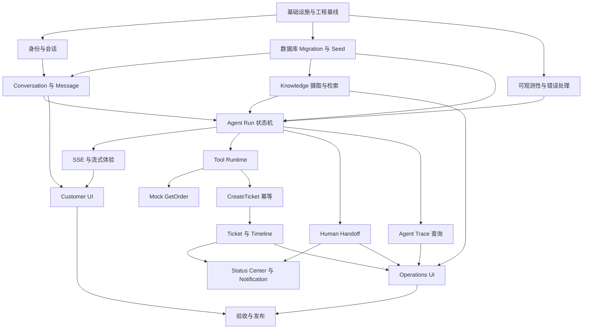

# SupportFlow 开发任务拆分

## 1. 文档信息

| 项目 | 内容 |
| --- | --- |
| 文档版本 | v1.0 |
| 文档状态 | 评审版（Review） |
| 对应产品版本 | v0.1 Technical Preview、v0.2 SupportFlow MVP |
| 编写日期 | 2026-07-25 |
| 上游文档 | [PRD](./PRD.md)、[Architecture](./Architecture.md)、[Database](./Database.md)、[API](./API.md) |
| 参考环境 | 2 vCPU / 2 GiB RAM / 40 GiB Disk |

## 2. 文档目的与范围

本文档把已经确认的产品、架构、数据库和 API 设计拆分成可以独立开发、测试、评审和提交的 Task。每个 Task 必须有明确依赖、交付物、验收条件和提交边界。

本文档已完成 v0.1 Technical Preview 和 v0.2 SupportFlow MVP 的任务拆分。当前进入编码阶段，仍不得提前实现 v0.3 Enterprise Foundation 的 Workspace、完整 RBAC、Audit、真实 Business Connector、复杂 Analytics、Workflow 或 Plugin。

## 3. 开发约束

1. PostgreSQL 是唯一业务事实源；Redis 只用于 Asynq、租约、限流和短期协调。
2. 所有核心数据访问必须携带 `tenant_id`，Customer 和 Workspace Member 身份必须分离。
3. Agent Runtime 只能执行五类固定路由，不允许动态扩展任务或无限重试。
4. Agent Run、Agent Trace、系统日志和未来 Audit 分离建模。
5. Trace 只保存脱敏业务轨迹，不保存 Prompt、CoT、凭证、完整 Chunk 或未脱敏输入。
6. Tool 权限由后端 Registry、Policy、Schema、对象归属和确认流程强制校验，不能依赖前端。
7. `CreateTicket` 使用 Idempotency Key；状态修改使用 ETag/`If-Match` 或等价并发条件。
8. 客户附件、扫描 PDF OCR、真实企业连接、多 Agent 和自动学习不属于 v0.2。
9. 每项变更都必须通过小范围测试和 `git diff --check`，不把无关重构混入业务 Task。

## 4. 版本里程碑

### 4.1 v0.1 Technical Preview

目标是验证最小 Agent 技术链路：

```text
Demo Session → Conversation → Agent Run → Knowledge Retrieval → Citation
                                      ↘ Trace ↗
```

必须具备 Chat、Knowledge、Citation、Agent Runtime 和基础 Trace；不要求 Ticket、真实订单、人工队列或企业 Workspace。

### 4.2 v0.2 SupportFlow MVP

目标是验证完整受控售后闭环：

```text
Customer
  → Knowledge Answer
  → Mock GetOrder
  → Customer Confirmation
  → CreateTicket
  → Human Handoff
  → Trace / Status Center
```

v0.2 使用单一默认 Tenant、Demo 身份和 Mock Business Data，不作为企业生产部署版本。

### 4.3 发布门槛

| 版本 | 完成条件 |
| --- | --- |
| v0.1 | 设计冻结、核心链路可运行、引用和基础 Trace 可查询、失败可恢复 |
| v0.2 | 五类固定路由和黄金路径闭环可运行，Tool/权限/确认/人工接管/反馈闭环通过验收 |
| v0.3 | 另行建立 Workspace、RBAC、Audit、Connector 和 Analytics 任务，不从 v0.2 任务中隐式扩展 |

## 5. 依赖关系



## 6. Task 生命周期与提交规则

### 6.1 Task 状态

| 状态 | 含义 |
| --- | --- |
| `待开始` | 依赖尚未满足或尚未领取 |
| `进行中` | 已确定负责人并开始实现 |
| `待评审` | 实现和自测完成，等待代码/产品评审 |
| `已完成` | 验收条件、文档和测试均完成 |
| `已取消` | 被明确移出当前版本，必须注明替代 Task 或版本 |

Task 不使用“顺手完成”的隐式状态。新增需求必须先更新 PRD、API 或本 Task 文档，再创建新 Task。

### 6.2 单 Task 交付要求

每个 Task 至少包含：

- 实现代码或明确的文档变更。
- 针对行为的单元、集成或契约测试；不适用时写出原因。
- 配置、Migration、Seed 或部署影响说明。
- 安全、租户、错误和降级行为说明。
- 一个聚焦的 Conventional Commit。

推荐提交格式：

```text
feat(agent): implement run state machine
fix(ticket): prevent duplicate creation
docs(api): update error contract
test(tool): cover permission failures
```

一个 Commit 不跨越多个无关 Task；需要拆分时使用依赖顺序提交，不在未评审状态下压缩掉关键设计变化。

## 7. 基础设施与工程基线任务

| ID | Task | 依赖 | 交付物与验收条件 | 状态 |
| --- | --- | --- | --- | --- |
| `T-001` | Go 模块与目录骨架 | 无 | Go 1.24+ 模块、模块边界、基础 `go test ./...` 可执行 | 已完成 |
| `T-002` | 配置与环境 Profile | T-001 | Development/Lite/Production-like 配置分层；密钥只来自环境或 Secret Reference | 已完成 |
| `T-003` | PostgreSQL Migration Runner | T-001、T-002 | 顺序 Migration、版本表、失败停止、空库可初始化 | 已完成 |
| `T-004` | v0.2 Database Schema 与 Seed | T-003 | 按 [Database](./Database.md) 建立表、索引、枚举、默认 Tenant 和 NovaTech Seed | 已完成 |
| `T-005` | Docker Compose Lite | T-002、T-003 | PostgreSQL + pgvector、Redis、App、Local Object Volume 可启动；不暴露内部端口 | 已完成 |
| `T-006` | HTTP 基础中间件 | T-001、T-002 | Request ID、JSON 错误 Envelope、Content-Type、Body 限制、稳定错误码 | 已完成 |
| `T-007` | Session 与 CSRF 基础 | T-002、T-006 | Demo Cookie、CSRF、过期/撤销、同源 CORS 和安全 Cookie 属性 | 待开始 |
| `T-008` | 日志与 OpenTelemetry 接入边界 | T-001、T-006 | `slog` 输出 stdout；敏感字段脱敏；Trace 与系统日志不混表 | 待开始 |
| `T-009` | 测试 Fixture 与 Mock Clock | T-003、T-004 | 可重复 Tenant、Customer、订单、文档、时间和 Session Fixture | 待开始 |

## 8. v0.1 Technical Preview 任务

| ID | Task | 依赖 | 交付物与验收条件 | 状态 |
| --- | --- | --- | --- | --- |
| `T-101` | Demo Session 与 Customer 上下文 | T-004、T-007 | 创建/查询 Session；每次查询注入唯一 Customer；过期后禁止业务访问 | 待开始 |
| `T-102` | Conversation 与 Message Service | T-004、T-009、T-101 | 会话创建、消息顺序、脱敏、分页和对象归属测试通过 | 待开始 |
| `T-103` | Agent Run 状态机 | T-004、T-102 | 实现固定状态转换、活动 Run 唯一性、步骤/重试上限和恢复查询 | 待开始 |
| `T-104` | Model Gateway Mock Adapter | T-002、T-103 | Mock 模式稳定返回；OpenAI-Compatible Provider 只使用白名单配置 | 待开始 |
| `T-105` | Context Builder 与 Policy Guard | T-103、T-104 | 固定信任层级、Prompt Injection 基础拒绝、输入长度和 Token Budget | 待开始 |
| `T-106` | Markdown/文本 PDF 上传与解析 | T-004、T-005、T-009 | 文件类型、Magic Bytes、10 MiB、数量校验；扫描 PDF 明确失败 | 待开始 |
| `T-107` | Chunk、Index Build 与 Hybrid Retrieval | T-003、T-106 | Processing/Failed/Ready 状态、Tenant/Published 过滤、词法 + pgvector 检索 | 待开始 |
| `T-108` | Citation Service | T-004、T-107、T-102 | 文档/章节/页码定位；Customer 不看到 Chunk ID；历史版本可追溯 | 待开始 |
| `T-109` | Agent Trace Recorder | T-004、T-103、T-107、T-108 | Append Only 事件、阶段耗时、Reason Code、脱敏和失败策略 | 待开始 |
| `T-110` | Agent SSE Stream | T-006、T-103、T-109 | `run.accepted`、业务状态、Delta、Citation、完成/失败事件；断线可恢复 | 待开始 |
| `T-111` | v0.1 Customer Chat 页面 | T-101、T-102、T-110 | Vue 3 + TS、TDesign Chat 二次封装、i18n、移动端流式体验 | 待开始 |
| `T-112` | v0.1 Technical Preview 验证 | T-104、T-107、T-108、T-109、T-111 | 固定知识问答集通过；引用率和 Trace 完整性达到 PRD 验收口径 | 待开始 |

v0.1 不实现订单查询、工单创建、人工队列、企业登录、真实业务系统连接和高级统计。

## 9. v0.2 Agent、Tool 与业务闭环任务

| ID | Task | 依赖 | 交付物与验收条件 | 状态 |
| --- | --- | --- | --- | --- |
| `T-201` | Feedback 与 Knowledge Todo | T-102、T-108、T-109 | 有帮助/无帮助、四类触发规则、去重、脱敏上下文和处理状态 | 待开始 |
| `T-202` | Mock Business Connector | T-004、T-009 | 标准 `GetOrder` 输入输出、Customer 归属校验和错误分类 | 待开始 |
| `T-203` | Tool Permission Registry 与 Executor | T-103、T-105、T-109、T-202 | 静态 ToolSpec、Policy/Schema/确认/租户校验、技术/业务结果分离 | 待开始 |
| `T-204` | GetOrder Tool | T-202、T-203 | 查询当前 Customer 订单列表/详情；越权、空结果、限流和临时失败测试 | 待开始 |
| `T-205` | CreateTicket 幂等 Tool | T-004、T-203 | 订单确认、业务资格校验、Customer 确认、Idempotency Key 和重复工单防护 | 待开始 |
| `T-206` | Ticket Domain 与 Activity Timeline | T-004、T-205 | 固定 Ticket 状态流转、可选订单/商品、来源/原因、公开/内部 Activity | 待开始 |
| `T-207` | Human Handoff Queue | T-004、T-103、T-109 | WAITING/IN_PROGRESS/ENDED/CANCELLED、客服领取竞争、三次未解决规则 | 待开始 |
| `T-208` | Customer Status Center 与通知 | T-004、T-102、T-206、T-207 | 会话/工单/接管聚合、业务事件通知、未读和站内跳转 | 待开始 |
| `T-209` | Durable Task 与恢复 Reconciler | T-003、T-004、T-005、T-106 | PostgreSQL 权威任务状态、Asynq 投递、租约恢复、有限重试 | 待开始 |
| `T-210` | 限流、Agent 并发与配额 | T-007、T-103、T-209 | Session 请求/Token/文件配额；Agent 默认并发 1、最大 2；超限可理解 | 待开始 |
| `T-211` | 安全输入与 Trace 脱敏 | T-006、T-008、T-109、T-203 | IDOR、敏感字段、Prompt Injection、文件输入和 Tool 参数安全测试 | 待开始 |
| `T-212` | v0.2 Agent 闭环编排 | T-201、T-204、T-205、T-207、T-208、T-210 | `Customer → Knowledge → Order Tool → Ticket → Human Handoff` 黄金路径完成 | 待开始 |

## 10. v0.2 前端与运营端任务

| ID | Task | 依赖 | 交付物与验收条件 | 状态 |
| --- | --- | --- | --- | --- |
| `T-301` | 前端应用壳与 i18n | T-111、API v1 契约 | 路由、布局、中文/英文资源、错误码映射、响应式基础能力 | 待开始 |
| `T-302` | Customer Chat 闭环页面 | T-110、T-204、T-205、T-207、T-301 | 文本输入、流式状态、订单卡片、确认卡片、工单卡片、引用和转人工 | 待开始 |
| `T-303` | Customer 状态中心 | T-208、T-301 | 会话、Ticket、Handoff、通知未读和移动端状态查看 | 待开始 |
| `T-304` | Operations 接管与工单页面 | T-206、T-207、T-301 | 待领取队列、领取、回复、Timeline、状态和转派 | 待开始 |
| `T-305` | Operations 知识页面 | T-106、T-107、T-201、T-301 | 上传、Processing/Review/Publish、反馈待办和基础效果字段 | 待开始 |
| `T-306` | Operations Trace 页面 | T-109、T-203、T-301 | 业务轨迹、阶段耗时、Tool 安全结果；明确不展示 CoT | 待开始 |

客户端和运营端使用分离导航；页面权限由 API 返回的授权错误最终决定，不能只依赖前端路由守卫。

## 11. 测试、可靠性与发布任务

| ID | Task | 依赖 | 交付物与验收条件 | 状态 |
| --- | --- | --- | --- | --- |
| `T-401` | Domain/State 单元测试 | T-103、T-206、T-207 | Run、Ticket、Handoff、Todo 状态转换和边界条件覆盖 | 待开始 |
| `T-402` | Repository/Service 集成测试 | T-004、T-203、T-209 | Tenant 归属、并发唯一性、幂等、发布原子性、任务恢复通过 | 待开始 |
| `T-403` | API/SSE Contract Test | T-110、T-212、T-302、T-304、T-305 | 按 API v1 错误码、ETag、Cursor、事件 Schema 验证 | 待开始 |
| `T-404` | 安全与异常场景测试 | T-211、T-403 | 越权、Prompt Injection、Tool 失败、知识缺失、断线、配额和重试上限 | 待开始 |
| `T-405` | 版本化黄金验收集 | T-212、T-403、T-404 | 冻结五类路由和事实范围；记录版本，不在本阶段决定测试数量方案 | 待开始 |
| `T-406` | Lite 服务器验证 | T-005、T-210、T-302、T-304 | 2 vCPU/2 GiB/40 GiB 参考环境启动、20 会话目标、日志轮转和磁盘告警 | 待开始 |
| `T-407` | 文档与开源发布 | T-405、T-406 | Quick Start、备份恢复说明、CHANGELOG、版本标签和发布检查清单 | 待开始 |

## 12. 建议实施顺序

### 第 1 批：基础骨架

先完成 `T-001` 至 `T-009`。该批只建立可运行工程、数据库、配置和安全边界，不实现业务智能。

### 第 2 批：v0.1 技术预览

按 `T-101 → T-102 → T-103 → T-104/T-105 → T-106/T-107 → T-108/T-109 → T-110 → T-111 → T-112` 推进。知识、Run、Trace 和 SSE 的接口必须先稳定，再扩大前端体验。

### 第 3 批：v0.2 售后闭环

按 `T-201 → T-202/T-203 → T-204 → T-205/T-206 → T-207 → T-208/T-209/T-210/T-211 → T-212` 推进。所有状态变更 Tool 先完成后端校验和 Trace，再接入 UI。

### 第 4 批：页面与发布

按 `T-301 → T-302/T-303 → T-304/T-305/T-306 → T-401/T-402/T-403/T-404 → T-405/T-406/T-407` 收尾。页面不能绕过 API 直接读数据库或调用 Model Provider。

## 13. Definition of Done

Task 只有同时满足以下条件才可标记 `已完成`：

- 行为符合 PRD、Architecture、Database 和 API 的当前版本。
- 代码、测试、配置、Migration、Seed 或文档影响已明确处理。
- 所有输入、权限、租户、错误、重试和降级路径有验证。
- 业务事实写入 PostgreSQL；Redis 丢失不会制造错误成功状态。
- Trace 记录业务阶段和失败原因，不含 CoT、凭证和未脱敏内容。
- 前端变更包含中文 i18n 文案，不把后端错误文案硬编码进组件。
- `git diff --check`、相关单元/集成/契约测试和构建命令通过。
- Commit 遵守 Conventional Commits，Pull Request 说明验证方式。

## 14. 明确不拆入 v0.2 的任务

以下内容不能以“顺便支持”的方式加入当前 Task：

- 多 Workspace 管理、完整 RBAC、Platform User、SSO、MFA 和临时授权。
- Audit 查询、导出和企业级合规报告。
- 真实企业订单/工单 Connector、全量同步或直接访问企业数据库。
- 任意 Model Provider 配置、模型市场或用户自定义 Endpoint。
- 自动学习、自动发布知识、多 Agent 协作和复杂 Workflow。
- Plugin Runtime、插件治理、Webhook、外部客服渠道和原生 App。
- 高级 Analytics、跨 Workspace 聚合、成本预测和企业级灾备。

发现这些需求时，先记录到后续 Roadmap，并说明不影响当前 MVP 验收，而不是直接扩展现有 Task。

## 15. 开发阶段检查清单

每个批次开始前确认：

- [ ] 上游文档版本没有未评审的范围变化。
- [ ] 当前 Task 的依赖已经 `已完成`。
- [ ] 预期数据库表和 API 已存在或在 Task 中明确新增。
- [ ] 2 vCPU/2 GiB Lite 环境的资源影响已评估。
- [ ] 失败、超时、重试、恢复和权限路径有负责人。

每个批次结束前确认：

- [ ] 黄金路径和至少一个异常路径已运行。
- [ ] Trace、日志和错误响应没有泄漏敏感数据。
- [ ] 文档索引、CHANGELOG 和版本边界已同步。
- [ ] 变更按独立 Commit 推送，远端 CI 通过。

## 16. 下一步

当前任务拆分完成后，下一阶段是编码实现。第一批应从 `T-001`、`T-002`、`T-003` 和 `T-006` 开始，先建立可测试的 Go 应用、配置、Migration 和 API 基础错误边界，再进入业务模块。
